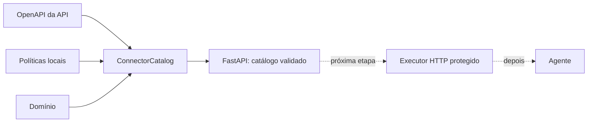

# IndusGuard

Plataforma fullstack, orientada a avaliações, para construir e implantar agentes de IA que usam
APIs REST descritas por OpenAPI.

O primeiro domínio é a API industrial sintética do desafio TRACTIAN × Inteli. A arquitetura,
porém, não conhece regras Tractian no núcleo: uma API entra por contrato e configuração.

## Em uma frase

O IndusGuard transforma **OpenAPI + política + domínio** em um catálogo confiável de operações que,
nas próximas etapas, será consumido por executor HTTP, MCP, LangGraph e frontend.

## Estado do projeto

O repositório está na primeira etapa executável.

| Capacidade | Situação |
|---|---|
| Monorepo e CI | Pronto |
| FastAPI e configuração | Pronto |
| Catálogo genérico de conectores | Pronto |
| Conector Tractian com 18 operações | Pronto |
| Conector sintético de extensibilidade | Pronto |
| Testes do núcleo | Pronto |
| Executor HTTP protegido | Próxima etapa |
| MCP e agente LangGraph/Groq | Planejado |
| Banco e OpenTelemetry | Planejado |
| Frontend Next.js | Planejado |
| Benchmark e dashboard | Planejado |

Importante: a aplicação atual **não chama a API Tractian e não chama um LLM**. Ela valida e expõe
o catálogo que tornará essas chamadas seguras.

## Por que começar pelo catálogo?

Um modelo pode pedir uma operação errada, mas não deve decidir sozinho quais endpoints existem,
quais são mutáveis ou quais permissões são necessárias. Essas decisões pertencem a código e
configuração versionada.

O catálogo cria essa fronteira antes da camada probabilística do agente:



## Modelo mental dos três arquivos

Cada pasta em `connectors/` responde a perguntas diferentes:

| Arquivo | Pergunta | Exemplo Tractian |
|---|---|---|
| `openapi.yaml` | O que a API oferece? | Existe `PATCH /assets/{assetId}`. |
| `profile.yaml` | O que permitimos e sob quais regras? | Exige `action_high` e confirmação. |
| `domain.yaml` | Como interpretar o domínio? | Baseline é o estado normal aprendido. |

OpenAPI descreve capacidade, não autorização. Por isso o profile é obrigatório.

## Estrutura do repositório

```text
indusguard/
├── .github/workflows/ci.yml       # lint e testes a cada push/PR
├── apps/
│   ├── api/
│   │   ├── src/indusguard_api/    # código FastAPI
│   │   └── tests/                 # testes do catálogo e sistema
│   └── web/                       # placeholder do frontend
├── connectors/
│   ├── tractian/                  # contrato industrial e suas políticas
│   └── synthetic/                 # segunda API, sem código Python específico
├── deploy/                        # infraestrutura futura
├── docs/                          # arquitetura e guias didáticos
├── evals/                         # benchmark futuro, isolado do runtime
├── .env.example                   # configuração sem segredos
└── Makefile                       # comandos de desenvolvimento
```

## Começar do zero

### 1. Requisitos

- Git;
- Python 3.12;
- acesso à internet na primeira instalação das dependências.

Confirme o Python:

```bash
python3.12 --version
```

### 2. Clonar e entrar no projeto

```bash
git clone https://github.com/ChristianGandra21/indusguard.git
cd indusguard
```

Se você já abriu esta pasta no VS Code, apenas use o terminal na raiz do repositório.

### 3. Criar o ambiente

```bash
make setup
```

Esse comando:

1. cria `.venv/`;
2. atualiza o `pip` dentro do ambiente;
3. instala o backend e as dependências de desenvolvimento.

Não é necessário ativar o virtualenv: o Makefile chama `.venv/bin/...` diretamente.

### 4. Configurar o ambiente local

```bash
cp .env.example .env
```

O arquivo `.env` é ignorado pelo Git. Nesta etapa, os valores default já funcionam; a cópia serve
para tornar a configuração visível e preparar as próximas etapas.

### 5. Validar conectores e rodar testes

```bash
make validate
make test
make lint
```

Resultado esperado do primeiro comando:

```text
2 conectores válidos
```

### 6. Iniciar a API

```bash
make dev-api
```

Acesse:

- Swagger UI: `http://127.0.0.1:8000/docs`;
- OpenAPI do próprio backend: `http://127.0.0.1:8000/openapi.json`;
- readiness: `http://127.0.0.1:8000/api/v1/ready`.

## Experimentar pelo terminal

Com a API rodando em outro terminal:

```bash
curl -s http://127.0.0.1:8000/api/v1/health
curl -s http://127.0.0.1:8000/api/v1/ready
curl -s http://127.0.0.1:8000/api/v1/version
curl -s http://127.0.0.1:8000/api/v1/connectors
curl -s http://127.0.0.1:8000/api/v1/connectors/tractian/operations
```

Exemplo de readiness:

```json
{
  "status": "ready",
  "connector_count": 2
}
```

Na listagem de operações você verá o método e o path vindos do OpenAPI junto com `enabled`,
`risk`, `permission` e confirmação vindos do profile.

## O que acontece quando a aplicação inicia

1. `main.py` cria `Settings` e `ConnectorCatalog`.
2. O lifespan do FastAPI chama `catalog.load()`.
3. O catálogo procura `connectors/*/profile.yaml` em ordem estável.
4. O profile é validado pelos modelos Pydantic.
5. O OpenAPI é lido com detecção de chaves duplicadas.
6. Restrições locais e estrutura OpenAPI são validadas.
7. Cada `operationId` é combinado com sua política.
8. Se tudo estiver correto, o catálogo completo substitui o estado anterior.
9. A aplicação fica pronta para responder.

Se qualquer conector falhar, o startup inteiro falha. Esse comportamento evita anunciar uma
integração parcialmente carregada como saudável.

## Endpoints atuais

| Método e path | Uso |
|---|---|
| `GET /api/v1/health` | Liveness do processo. |
| `GET /api/v1/ready` | Readiness e quantidade de conectores. |
| `GET /api/v1/version` | Versão, ambiente e `simulate|execute`. |
| `GET /api/v1/connectors` | Lista integrações sem segredos. |
| `GET /api/v1/connectors/{id}/operations` | Lista operações e políticas consolidadas. |

`health` e `ready` não são sinônimos. O primeiro diz que o processo responde; o segundo depende do
startup bem-sucedido do catálogo.

## Comandos de desenvolvimento

| Comando | O que faz |
|---|---|
| `make setup` | Cria ambiente e instala API + ferramentas de desenvolvimento. |
| `make dev-api` | Inicia Uvicorn com reload. |
| `make validate` | Carrega todos os conectores e falha se houver inconsistência. |
| `make test` | Executa pytest. |
| `make lint` | Verifica regras Ruff e formatação. |
| `make format` | Corrige imports/estilo suportados e formata Python. |

## Segurança já implementada

- operação não declarada no profile começa desabilitada;
- chaves YAML duplicadas são erro;
- `$ref` externo é recusado;
- payload binário e conteúdo não JSON são recusados;
- arquivo OpenAPI não pode escapar da pasta do conector;
- `operationId` é obrigatório e único;
- profile não pode apontar para operação inexistente;
- política `read|write` não pode contradizer o método HTTP;
- config desconhecida no profile é erro, não warning;
- modo default é `simulate`;
- endpoints do catálogo não revelam credenciais resolvidas.

## Integração contínua

O workflow `.github/workflows/ci.yml` roda em pushes para `main` e em pull requests. Ele:

1. prepara Python 3.12;
2. instala o backend com dependências de desenvolvimento;
3. executa Ruff e verifica formatação;
4. executa pytest com relatório de cobertura.

Localmente, `make lint` e `make test` reproduzem as verificações principais antes de um commit.

## Particularidade do contrato Tractian

O OpenAPI recebido repetia a chave `/assets/{assetId}`: uma ocorrência continha GET e outra PATCH.
Parsers YAML comuns podem descartar uma delas. A cópia versionada une os dois métodos sob o mesmo
path, e um teste garante que `getAsset` e `updateAssetConfig` continuem presentes.

Os materiais de avaliação fornecidos pelos stakeholders não entram no runtime. O relatório da
análise está em [docs/stakeholder-material.md](docs/stakeholder-material.md).

## Hipótese experimental

A hipótese planejada é:

> Uma camada determinística de políticas reduz chamadas inseguras ou sem evidência, comparada a um
> agente prompt-only, sem perder mais de 1 dos 16 cenários oficiais nem adicionar mais de 25% de
> latência mediana.

Ela ainda não foi testada. As métricas só serão publicadas depois que executor, agente e runner de
avaliação existirem.

## Stack planejada

- Web: Next.js, TypeScript, Tailwind, shadcn/ui, TanStack Query e Recharts;
- API: Python 3.12, FastAPI e Pydantic v2;
- Agente: LangGraph, MCP e Groq;
- Execução: httpx e validação JSON Schema/OpenAPI;
- Dados: SQLAlchemy, Alembic, PostgreSQL e fallback SQLite;
- Observabilidade: OpenTelemetry e OTLP;
- Qualidade: pytest, respx, Schemathesis, Vitest e Playwright;
- Entrega: Docker e GitHub Actions.

“Planejada” significa que parte dessa stack ainda não está no código.

## Próxima etapa

O próximo incremento é o executor HTTP genérico. Ele deverá:

1. receber uma operação já validada pelo catálogo;
2. validar path, query, headers e body pelo OpenAPI;
3. resolver autenticação sem enviar segredos ao modelo;
4. aplicar allowlist da URL-base;
5. respeitar timeout, retry e idempotência;
6. simular POST/PATCH quando `EXECUTION_MODE=simulate`;
7. redigir dados sensíveis;
8. devolver um envelope comum de status, dados, erro e latência.

Somente depois essa camada será apresentada como tools MCP ao LangGraph.

## Roteiro de estudo recomendado

1. Leia este README até “O que acontece quando a aplicação inicia”.
2. Abra [docs/code-guide.md](docs/code-guide.md).
3. Compare `connectors/synthetic/openapi.yaml` com seu `profile.yaml`.
4. Leia `Settings`, depois os schemas, depois `ConnectorCatalog`.
5. Rode `make test` e leia cada teste como uma regra do sistema.
6. Altere temporariamente uma cópia de profile para provocar um erro e observar o fail-fast.

## Glossário rápido

| Termo | Significado neste projeto |
|---|---|
| OpenAPI | Documento que descreve endpoints, parâmetros e schemas de uma API. |
| Conector | Pasta que reúne OpenAPI, políticas e linguagem de domínio. |
| `operationId` | Nome estável que liga uma operação às políticas e intenções. |
| Fail-fast | Interromper o startup ao encontrar configuração inválida. |
| Liveness | “O processo está respondendo?” |
| Readiness | “O processo terminou de carregar e pode receber tráfego?” |
| Idempotente | Operação que pode ser repetida sem multiplicar seu efeito. |
| Redaction | Remoção de valores sensíveis antes de trace ou persistência. |
| Drift de contrato | Diferença entre OpenAPI, profile, código ou tipos gerados. |

## Documentação detalhada

- [Índice da documentação](docs/README.md)
- [Arquitetura e fronteiras](docs/architecture.md)
- [Guia de leitura do código](docs/code-guide.md)
- [Guia para criar conectores](connectors/README.md)
- [Avaliação do material dos stakeholders](docs/stakeholder-material.md)
- [Backend FastAPI](apps/api/README.md)

## Problemas comuns

### `python3.12: command not found`

Instale Python 3.12 ou ajuste conscientemente o Makefile depois de verificar compatibilidade.

### `diretório de conectores não encontrado`

Execute os comandos na raiz do repositório ou ajuste `INDUSGUARD_CONNECTORS_DIR` no `.env`.

### `chave YAML duplicada`

Una métodos do mesmo path sob uma única chave. Não remova a validação para fazer o serviço subir.

### `políticas apontam para operationIds inexistentes`

Compare os nomes em `profile.yaml` com os `operationId` do OpenAPI. Isso normalmente indica typo ou
mudança no contrato externo.

### A API Tractian não respondeu

O backend atual ainda não chama a API Tractian. Se o catálogo e Swagger do IndusGuard funcionam, a
primeira etapa está correta; integração HTTP pertence ao próximo incremento.
