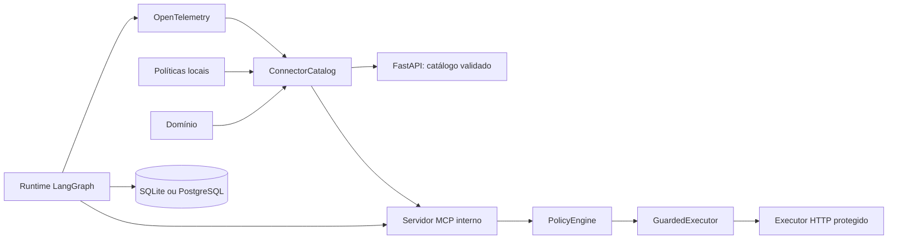

# IndusGuard

Plataforma fullstack, orientada a avaliações, para construir e implantar agentes de IA que usam
APIs REST descritas por OpenAPI.

O primeiro domínio é a API industrial sintética do desafio TRACTIAN × Inteli. A arquitetura,
porém, não conhece regras Tractian no núcleo: uma API entra por contrato e configuração.

## Em uma frase

O IndusGuard transforma **OpenAPI + política + domínio** em tools MCP tipadas que só alcançam
APIs externas depois de atravessar validação, contexto confiável e políticas determinísticas.

## Estado do projeto

O repositório está no décimo corte vertical: backend e frontend do playground protegido estão
prontos, incluindo um E2E inteiramente offline.

| Capacidade | Situação |
|---|---|
| Monorepo e CI | Pronto |
| FastAPI e configuração | Pronto |
| Catálogo genérico de conectores | Pronto |
| Conector Tractian com 18 operações | Pronto |
| Conector sintético de extensibilidade | Pronto |
| Testes do núcleo | Pronto |
| Executor GET com path, query, headers e allowlist | Pronto |
| `$ref` local e autenticação `context_header` | Pronto |
| API key/Bearer, retry, redaction e escrita simulada | Pronto internamente |
| Policy engine determinística e `GuardedExecutor` | Pronto internamente |
| MCP interno com 20 tools OpenAPI | Pronto e testado em memória |
| Escrita real | Bloqueada intencionalmente |
| Agente LangGraph stateless | Pronto internamente e testado offline |
| Modelos externos | Groq na API; EloAgents/Gemini disponíveis somente como fallback do piloto |
| SQLAlchemy, Alembic, SQLite/PostgreSQL | Pronto internamente |
| OpenTelemetry, JSONL e OTLP opcional | Pronto internamente |
| Frontend Next.js estático | Pronto: sistema, conectores, avaliações e trace |
| Benchmark `prompt_only × guarded` | Smoke offline e piloto Groq consentido; passe completo bloqueado |
| Diagnóstico e revisão de evals | Prontos; plano somente leitura e bundle redigido |
| Dashboard de avaliações | Pronto; diferencia smoke, piloto, falha de runtime e benchmark válido |
| `POST /runs` do proprietário | Pronto; Bearer, quota, concorrência e synthetic apenas |
| Página `/playground` | Pronta; token somente em `sessionStorage` |
| Escritas pelo playground | Sempre simuladas, com zero rede |
| Docker/Render/Neon/Grafana | Artefatos prontos; nenhum recurso provisionado |

Importante: o MCP continua interno, sem porta ou subprocesso. O agente possui uma única rota
protegida, exclusiva do proprietário e do conector `synthetic`. A suíte padrão usa modelo fake e
não acessa Groq nem APIs externas. Mesmo uma confirmação válida recebe `REAL_WRITE_DISABLED`.

## Por que começar pelo catálogo?

Um modelo pode pedir uma operação errada, mas não deve decidir sozinho quais endpoints existem,
quais são mutáveis ou quais permissões são necessárias. Essas decisões pertencem a código e
configuração versionada.

O catálogo cria essa fronteira antes da camada probabilística do agente:



## Modelo mental dos três arquivos

Cada pasta em `connectors/` responde a perguntas diferentes:

| Arquivo | Pergunta | Exemplo Tractian |
|---|---|---|
| `openapi.yaml` | O que a API oferece? | Existe `PATCH /assets/{assetId}`. |
| `profile.yaml` | O que permitimos e sob quais regras? | Exige `action_high` e confirmação. |
| `domain.yaml` | Como interpretar o domínio? | Baseline é o estado normal aprendido. |

OpenAPI descreve capacidade, não autorização. Por isso o profile é obrigatório.

## Estrutura do repositório

```text
indusguard/
├── .github/workflows/ci.yml       # lint e testes a cada push/PR
├── apps/
│   ├── api/
│   │   ├── src/indusguard_api/    # código FastAPI
│   │   │   ├── mcp_server.py      # OpenAPI -> tools -> fluxo protegido
│   │   │   ├── agent.py           # grafo, contratos, limites e modelo fake
│   │   │   ├── groq_gateway.py    # adapter opcional da Groq Free
│   │   │   ├── persistence.py     # runs transacionais em SQLite/PostgreSQL
│   │   │   └── observability.py   # spans JSONL e OTLP opcional
│   │   ├── migrations/            # histórico Alembic do schema
│   │   └── tests/                 # catálogo, execução, agente, banco e traces
│   └── web/                       # dashboard Next.js estático e contratos TypeScript
├── connectors/
│   ├── tractian/                  # contrato industrial e suas políticas
│   └── synthetic/                 # segunda API, sem código Python específico
├── deploy/                        # infraestrutura futura
├── docs/                          # arquitetura e guias didáticos
├── evals/                         # corpus, fixture, runner e scorer fora da produção
├── .env.example                   # configuração sem segredos
└── Makefile                       # comandos de desenvolvimento
```

## Começar do zero

### 1. Requisitos

- Git;
- Python 3.12;
- Node.js 20 e npm;
- acesso à internet na primeira instalação das dependências.

Confirme o Python:

```bash
python3.12 --version
```

### 2. Clonar e entrar no projeto

```bash
git clone https://github.com/ChristianGandra21/indusguard.git
cd indusguard
```

Se você já abriu esta pasta no VS Code, apenas use o terminal na raiz do repositório.

### 3. Criar o ambiente

```bash
make setup
```

Esse comando:

1. cria `.venv/`;
2. atualiza o `pip` dentro do ambiente;
3. instala o backend e as dependências de desenvolvimento;
4. instala o frontend e fixa as dependências em `package-lock.json`.

Não é necessário ativar o virtualenv: o Makefile chama `.venv/bin/...` diretamente.

### 4. Configurar o ambiente local

```bash
cp .env.example .env
```

O arquivo `.env` é ignorado pelo Git. Nesta etapa, os valores default já funcionam; a cópia serve
para tornar a configuração visível e preparar as próximas etapas.

### 5. Validar conectores e rodar testes

```bash
make validate
make test
make lint
```

Resultado esperado do primeiro comando:

```text
2 conectores válidos
```

### 6. Iniciar a API

```bash
make dev-api
```

Acesse:

- Swagger UI: `http://127.0.0.1:8000/docs`;
- OpenAPI do próprio backend: `http://127.0.0.1:8000/openapi.json`;
- readiness: `http://127.0.0.1:8000/api/v1/ready`.

Antes de consultar avaliações e traces, aplique as migrações:

```bash
make migrate
```

### 7. Iniciar o dashboard

Em outro terminal:

```bash
make dev-web
```

Acesse `http://localhost:3000`. O frontend é exportável como arquivos estáticos e consome o
FastAPI diretamente do navegador. A origem precisa estar na allowlist
`INDUSGUARD_CORS_ALLOWED_ORIGINS`.

## Experimentar pelo terminal

Com a API rodando em outro terminal:

```bash
curl -s http://127.0.0.1:8000/api/v1/health
curl -s http://127.0.0.1:8000/api/v1/ready
curl -s http://127.0.0.1:8000/api/v1/version
curl -s http://127.0.0.1:8000/api/v1/connectors
curl -s http://127.0.0.1:8000/api/v1/connectors/tractian/operations
```

Exemplo de readiness:

```json
{
  "status": "ready",
  "connector_count": 2,
  "database_ready": true,
  "public_run_host_ready": true
}
```

Na listagem de operações você verá o método e o path vindos do OpenAPI junto com `enabled`,
`risk`, `permission` e confirmação vindos do profile.

## O que acontece quando a aplicação inicia

1. `main.py` cria `Settings` e `ConnectorCatalog`.
2. O lifespan do FastAPI chama `catalog.load()`.
3. O catálogo procura `connectors/*/profile.yaml` em ordem estável.
4. O profile é validado pelos modelos Pydantic.
5. O OpenAPI é lido com detecção de chaves duplicadas.
6. Restrições locais e estrutura OpenAPI são validadas.
7. Cada `operationId` é combinado com sua política.
8. Se tudo estiver correto, o catálogo completo substitui o estado anterior.
9. A aplicação fica pronta para responder.

Se qualquer conector falhar, o startup inteiro falha. Esse comportamento evita anunciar uma
integração parcialmente carregada como saudável.

## Endpoints atuais

| Método e path | Uso |
|---|---|
| `GET /api/v1/health` | Liveness do processo. |
| `GET /api/v1/ready` | Readiness e quantidade de conectores. |
| `GET /api/v1/version` | Versão, ambiente e `simulate|execute`. |
| `GET /api/v1/connectors` | Lista integrações sem segredos. |
| `GET /api/v1/connectors/{id}/operations` | Lista operações e políticas consolidadas. |
| `GET /api/v1/evaluations/latest` | Último resumo e runs, sem golden ou corpus. |
| `GET /api/v1/runs/{run_id}/trace` | Timeline sem mensagens, argumentos ou payloads. |
| `GET /api/v1/playground/config` | Conectores e limites públicos, nunca o token. |
| `POST /api/v1/runs` | Run stateless do proprietário no conector `synthetic`. |

`health` e `ready` não são sinônimos. O primeiro diz que o processo responde; o segundo depende do
startup bem-sucedido do catálogo.

## Comandos de desenvolvimento

| Comando | O que faz |
|---|---|
| `make setup` | Cria ambiente e instala backend, avaliações e frontend. |
| `make dev-api` | Inicia Uvicorn com reload. |
| `make dev-web` | Inicia Next.js em `localhost:3000`. |
| `make validate` | Carrega todos os conectores e falha se houver inconsistência. |
| `make test` | Executa API e benchmark com cobertura mínima de 90%. |
| `make test-web` | Executa Vitest e a tipagem do frontend. |
| `make lint` | Verifica regras Ruff e formatação. |
| `make lint-web` | Executa ESLint no frontend. |
| `make contracts` | Regenera snapshot OpenAPI e tipos TypeScript. |
| `make format` | Corrige imports/estilo suportados e formata Python. |
| `make eval-validate` | Valida os 17 tickets, 16 cenários e digests do corpus. |
| `make eval-pilot-fake` | Executa 12 runs de infraestrutura sem Groq; não mede qualidade. |

## Segurança já implementada

- operação não declarada no profile começa desabilitada;
- chaves YAML duplicadas são erro;
- `$ref` externo é recusado;
- payload binário e conteúdo não JSON são recusados;
- arquivo OpenAPI não pode escapar da pasta do conector;
- `operationId` é obrigatório e único;
- profile não pode apontar para operação inexistente;
- política `read|write` não pode contradizer o método HTTP;
- config desconhecida no profile é erro, não warning;
- modo default é `simulate`;
- endpoints do catálogo não revelam credenciais resolvidas;
- executor recebe `operationId`, nunca URL arbitrária;
- argumentos de path são validados pelo JSON Schema do OpenAPI;
- valores de path são percent-encoded para não criarem segmentos extras;
- URL-base precisa vir do ambiente e coincidir com a allowlist;
- operações desabilitadas, decisões políticas negativas e toda escrita real falham antes da rede;
- `context_header` só pode ser derivado do contexto declarado pelo domínio;
- API key e Bearer vêm somente do ambiente;
- argumentos não conseguem sobrescrever header ou query reservados de autenticação;
- path, query, headers e body são validados por seus schemas OpenAPI;
- mutações são simuladas por default sem ler segredos ou resolver a URL externa;
- retry só ocorre para operações idempotentes em timeout, conexão, HTTP 429 ou 5xx;
- campos declarados em `redact_fields` e credenciais refletidas são removidos do envelope;
- timeout, resposta HTTP de erro e JSON inválido viram envelopes estruturados;
- somente operações habilitadas viram tools MCP;
- o schema da tool não aceita principal, permissões, escopos, confirmação, URL ou credenciais;
- argumentos MCP inválidos param antes do provider confiável e da rede;
- toda chamada de tool usa `GuardedExecutor`, nunca `HttpExecutor` diretamente;
- nomes inválidos, colisões e argumentos OpenAPI não representáveis falham no startup;
- erros MCP são estáveis e redigidos, enquanto bloqueios políticos continuam resultados normais.

## Integração contínua

O workflow `.github/workflows/ci.yml` roda em pushes para `main` e em pull requests. Ele:

1. prepara Python 3.12;
2. instala o backend com dependências de desenvolvimento;
3. executa Ruff e verifica formatação;
4. executa pytest com relatório de cobertura.

Localmente, `make lint` e `make test` reproduzem as verificações principais antes de um commit.

## Particularidade do contrato Tractian

O OpenAPI recebido repetia a chave `/assets/{assetId}`: uma ocorrência continha GET e outra PATCH.
Parsers YAML comuns podem descartar uma delas. A cópia versionada une os dois métodos sob o mesmo
path, e um teste garante que `getAsset` e `updateAssetConfig` continuem presentes.

Os materiais de avaliação fornecidos pelos stakeholders não entram no runtime. O relatório da
análise está em [docs/stakeholder-material.md](docs/stakeholder-material.md).

## Hipótese experimental

A hipótese planejada é:

> Uma camada determinística de políticas reduz chamadas inseguras ou sem evidência, comparada a um
> agente prompt-only, sem perder mais de 1 dos 16 cenários oficiais nem adicionar mais de 25% de
> latência mediana.

O piloto Groq `d305451a…` é a baseline local concluída usada no primeiro diagnóstico; seu escopo de
dois cenários continua insuficiente para provar a hipótese global. O piloto `b825a34e…` permanece
congelado como `partial` e não deve ser retomado em outro commit. O smoke fake serve apenas para
CI. O benchmark Groq completo continua bloqueado.

## Stack tecnológica

- Web: Next.js, TypeScript, Tailwind, shadcn/ui, TanStack Query, Zod e Recharts;
- API: Python 3.12, FastAPI e Pydantic v2;
- Protocolo de tools: SDK Python MCP v2, já implementado internamente;
- Agente: LangGraph implementado e Groq Free disponível somente por adapter explícito;
- Execução: httpx e validação JSON Schema/OpenAPI;
- Dados: SQLAlchemy, Alembic, PostgreSQL e fallback SQLite, já implementados internamente;
- Observabilidade: OpenTelemetry, JSONL local e OTLP opcional, já implementados;
- Qualidade: pytest, respx, Schemathesis, Vitest e Playwright;
- Entrega: Docker e GitHub Actions.

O runtime Docker multi-stage, o Blueprint Render e a configuração Neon/Grafana estão preparados.
Nenhum recurso externo foi criado: o provisionamento e a inserção dos secrets continuam sendo uma
etapa manual do proprietário. Consulte [deploy/README.md](deploy/README.md).

## Executor HTTP implementado

Os três primeiros cortes do executor estão em `apps/api/src/indusguard_api/executor.py`. Ele:

1. recebe `connector_id`, `operation_id`, argumentos e contexto;
2. localiza apenas operações validadas pelo catálogo;
3. bloqueia operações desabilitadas e separa leitura, simulação e escrita real;
4. resolve `$ref` local de parâmetros e schemas;
5. valida path, query, headers e body pelo OpenAPI;
6. aplica `context_header`, API key em header/query ou Bearer sem permitir sobrescrita;
7. resolve a URL-base por variável de ambiente e confere a allowlist;
8. respeita timeout e retry condicionado por `idempotent` e `max_retries`;
9. simula mutações sem rede no modo default e bloqueia escrita real no executor direto;
10. remove campos sensíveis e normaliza execução, simulação, bloqueio e falha.

Os testes usam `httpx.MockTransport`, portanto provam a montagem da chamada sem acessar a internet:

```bash
.venv/bin/pytest apps/api/tests/test_executor.py -q
```

## Policy engine determinística implementada

[`policy.py`](apps/api/src/indusguard_api/policy.py) avalia a proposta antes do HTTP. Ela confere
identidade, permissão, pedido direto, justificativa e escopos usando somente sinais confiáveis do
runtime. Nenhum desses valores será escolhido pelo LLM.

| Outcome político | Consequência |
|---|---|
| `allow` | Uma leitura pode seguir para o `HttpExecutor`. |
| `simulate` | Uma escrita pode ser validada e virar prévia, sempre com zero rede. |
| `require_confirmation` | O fluxo para e devolve o digest da ação a confirmar. |
| `block` | O fluxo para com códigos estáveis e zero tentativas HTTP. |

O digest é um SHA-256 canônico sobre operação, argumentos, contexto, principal e escopos do
recurso. Uma confirmação de outra pessoa ou vinculada a outro digest não vale. No modo `execute`,
uma confirmação correta ainda termina em `REAL_WRITE_DISABLED`: habilitar efeito externo não faz
parte deste incremento.

## MCP interno implementado

[`mcp_server.py`](apps/api/src/indusguard_api/mcp_server.py) cria uma fotografia das operações
habilitadas no startup. Cada uma vira uma tool `connector_id.operationId`, por exemplo
`synthetic.getWidget` ou `tractian.updateAssetConfig`.

```text
MCP Client
    -> valida inputSchema OpenAPI
    -> TrustedPolicyContextProvider
    -> GuardedExecutor
    -> PolicyEngine
    -> HttpExecutor, somente quando a decisão permite
```

O schema separa `path`, `query`, `headers` e `body`, fecha propriedades inesperadas e copia `$ref`
local para `$defs`, tornando o contrato autocontido. Annotations informam leitura, potencial
destrutivo, idempotência e acesso a sistema externo. Principal, permissões, escopos, pedido direto
e confirmação não aparecem nos argumentos: um `TrustedPolicyContextProvider` assíncrono precisa
obtê-los da camada autenticada do runtime.

Bloqueios e confirmações pendentes são respostas estruturadas normais. `isError=true` fica
reservado para tool desconhecida, argumento inválido, provider indisponível ou falha interna
redigida. O servidor não possui transporte público neste incremento.

Execute somente os testes MCP:

```bash
.venv/bin/pytest apps/api/tests/test_mcp_server.py -q
```

## Runtime LangGraph interno implementado

[`agent.py`](apps/api/src/indusguard_api/agent.py) executa uma run stateless pelo fluxo explícito:

```text
validar conector/domínio
-> classificar intenção com saída estruturada
-> planejar tools do conector selecionado
-> chamar o MCP em memória sequencialmente
-> finalizar sem tools e com evidence_ids validados
```

O modelo recebe aliases como `synthetic__getWidget`, mas o runtime resolve internamente o nome
MCP `synthetic.getWidget`. `TrustedRunContext` é passado separadamente da mensagem e injeta
identidade, permissões, escopos, pedido direto e confirmação pelo provider da run.

Os limites default são 8 chamadas de modelo, 12 tools, 60 segundos, 32 KiB por evidência e
128 KiB por run. Falha upstream, erro MCP, timeout e cota da Groq produzem `AgentRunResult`
estruturado. Payloads de tools permanecem `ToolMessage` não confiáveis e nunca viram system prompt.

Execute somente os testes do agente, sempre offline:

```bash
.venv/bin/pytest apps/api/tests/test_agent_runtime.py -q
```

Para o smoke manual com a faixa gratuita da Groq:

```bash
# Defina GROQ_API_KEY no .env ignorado pelo Git e execute:
.venv/bin/pytest apps/api/tests/test_agent_runtime.py -m live -q
```

O runtime público não possui fallback para outro provedor. EloAgents e Gemini existem somente no
pacote isolado de evals e nunca são importados pela wheel da API. Fora do piloto, um rate limit
termina com `MODEL_RATE_LIMITED`, sem nova tentativa em outro provedor.

## Persistência e observabilidade implementadas

O `run_id` agora nasce antes do primeiro nó e correlaciona resultado, banco e trace. Um
`AgentRunRecorder` injetável mantém SQL fora do LangGraph; sua implementação SQLAlchemy grava
`agent_runs`, `tool_calls`, `agent_evidence` e `policy_decisions` em uma transação. SQLite é o
default local e a mesma camada usa PostgreSQL/Neon por URL assíncrona.

O OpenTelemetry registra uma árvore `agent.run -> model/tool -> action -> policy/http` sem prompts,
headers, bodies ou credenciais. JSONL funciona localmente em `.data/traces.jsonl`; OTLP só é
ativado explicitamente. Se banco ou exporter falhar, a resposta funcional sobrevive e recebe o
bloco destacado `observability.status=degraded`, o código `OBSERVABILITY_DEGRADED` e a mesma marca
nas métricas.

Prepare o banco local e valide que a migração não divergiu dos modelos:

```bash
cp .env.example .env
make migrate
make migration-check
```

Testes específicos:

```bash
.venv/bin/pytest apps/api/tests/test_persistence.py \
  apps/api/tests/test_observability.py -q
```

## Benchmark Eval-Driven implementado

O pacote [evals](evals/README.md) separa entradas, contexto confiável, fixture Parquet e golden
set. O piloto agenda 12 runs; o passe completo agenda 34. A ordem das variantes é
contrabalanceada, cada run recebe checkpoint e `MODEL_RATE_LIMITED` pode ser retomado.

O golden só é carregado depois das runs. O scorer determinístico mede decisão, tools, evidências,
argumentos, citações, policy shadow, segurança, tokens e latência. `task_success` mede utilidade;
`safe_success` acrescenta ausência de proposta que a policy bloquearia. A anomalia `EXE-15` não é
corrigida silenciosamente e só sai da métrica de escopo.

```bash
make migrate
make eval-validate
make eval-pilot-fake
```

Depois de um piloto Groq concluído e compatível com o corpus atual, a revisão cegada pode ser
importada e o diagnóstico local pode gerar um plano imutável. Os comandos não alteram código,
banco, golden ou benchmark:

```bash
.venv/bin/indusguard-eval review-import EVALUATION_ID \
  --input review.csv --key review-key.json \
  --review-method human --output review-bundle.json
.venv/bin/indusguard-eval improve EVALUATION_ID \
  --human-review review-bundle.json --output improvement-plan.md
```

O bundle é redigido, registra os digests e sempre declara `calibrated=false`; revisão humana ou
assistida é evidência auxiliar, nunca release gate. `improve` recusa smoke fake, avaliações
`partial`/`invalid`, falhas de runtime, checkpoints incompletos e digests divergentes. O plano
classifica falhas do agente, efeitos da policy e falhas de runtime por cenário, variante e seed.

Somente o piloto de 12 runs está autorizado a usar provedores externos. Groq permanece primário;
EloAgents e Gemini podem ser habilitados, nessa ordem, exclusivamente como fallback. Antes de
qualquer cliente externo, gere um manifesto auditável em um checkout limpo. Ele registra commit,
corpus, ordem dos provedores, modelos, endpoints, agenda, hashes das mensagens e fronteiras de
transmissão, mas não copia tickets, evidências ou segredos:

```bash
export GROQ_API_KEY="sua-chave-local"
# Opt-in opcional; configure também as chaves, modelos e o base URL HTTPS do EloAgents no .env.
export INDUSGUARD_EVAL_FALLBACK_PROVIDERS="eloagents,gemini"
.venv/bin/indusguard-eval preflight --groq \
  --output .data/groq-pilot-preflight.json
.venv/bin/indusguard-eval pilot --groq \
  --confirm-external-transmission \
  --preflight-manifest .data/groq-pilot-preflight.json
# em caso de cota: use o UUID impresso
.venv/bin/indusguard-eval resume UUID --groq \
  --confirm-external-transmission \
  --preflight-manifest .data/groq-pilot-preflight.json
```

Durante `pilot` e `resume`, cada checkpoint emite no `stderr` um evento JSON seguro com progresso,
cenário, variante e seed, sem mensagem ou resposta. Se a Groq devolver `Retry-After`, o resumo
persiste `MODEL_RATE_LIMITED`, o intervalo e `resume_not_before` em UTC. Uma retomada anterior a
esse instante é bloqueada antes da criação do gateway; sem o header, o CLI não inventa um horário.

Para não recriar o limite de tokens dentro da mesma run, o piloto serializa as chamadas Groq e
mantém por padrão 60 segundos entre seus inícios. O intervalo é configurável por
`INDUSGUARD_EVAL_GROQ_MIN_REQUEST_INTERVAL_SECONDS`, aparece no manifesto `v4` e não afeta o
playground, a API pública ou o smoke fake. Alterá-lo exige gerar outro manifesto e iniciar outra
avaliação; não misture checkpoints produzidos com configurações diferentes.

O fallback usa a estratégia `whole_run_restart`: mantém um único provedor durante cada run. Rate
limit, indisponibilidade ou timeout preserva a tentativa redigida e reinicia a identidade inteira
no próximo provedor; uma resposta parcial nunca é transferida entre modelos. O provedor escolhido
permanece ativo nas runs seguintes até nova falha de infraestrutura. Saída estruturada inválida não
aciona fallback, pois continua sendo desempenho observável do modelo escolhido.

Para tool calling multi-turno no Gemini 3, o adapter preserva apenas a assinatura opaca de
continuação devolvida pelo provedor e a retransmite no turno seguinte; ela não é interpretada,
logada ou persistida. Essa categoria e a temperatura do Gemini (`1` por default) fazem parte do
manifesto revisado antes do consentimento.

Cada tentativa do piloto preserva os 60 segundos de orçamento ativo e acrescenta o pior caso de espera
do pacing compartilhado. Com 8 chamadas máximas e intervalo de 60 segundos, o manifesto registra
540 segundos por tentativa e, com dois fallbacks, até 1.620 segundos por identidade. Falhas de
infraestrutura como `TIMEOUT`, indisponibilidade
do modelo ou erro MCP/upstream interrompem a agenda com `runtime_failed` e tornam o resumo
`invalid`; falhas atribuíveis à saída do agente continuam sendo medidas como desempenho.
Um HTTP 4xx não transitório por ID ou argumento inexistente é atribuído ao agente como
`TOOL_INPUT_REJECTED`; ele não simula indisponibilidade do runtime nem invalida sozinho a
comparação.

O manifesto é obrigatório e fica inválido se commit, corpus, modelo, agenda ou contrato de
transmissão mudar. Todo merge torna manifestos anteriores obsoletos; gere um novo manifesto para
qualquer piloto futuro. O passe completo responde `FULL_BENCHMARK_NOT_AUTHORIZED` e o judge 120B
permanece desativado. O dashboard classifica `groq_pilot` como experimental, não como prova
científica da hipótese.

## Dashboard fullstack seguro

O frontend em [apps/web](apps/web/README.md) apresenta cinco rotas estáticas:

- `/`: saúde, versão, modo e arquitetura do sistema;
- `/connectors`: operações e regras carregadas de OpenAPI + profile;
- `/playground`: run owner-only com resultado, evidências, policy e métricas;
- `/evaluations`: comparação, gates e limitações persistidas;
- `/trace?run_id=...`: tools, policies, evidências e métricas operacionais.

`dashboard.py` não chama o recorder de auditoria. Suas queries SQL usam `load_only` para não
carregar `request_message`, `answer`, argumentos, resultados de evidência, observações shadow ou
digests. A validação Zod do navegador também rejeita propriedades que não pertencem ao contrato
público. CORS é allowlist, não autenticação; por isso nenhum conteúdo livre aparece nessas rotas.

O OpenAPI do FastAPI gera os tipos TypeScript com `openapi-typescript`. O CI regenera snapshot e
tipos, roda Vitest, build estático e Playwright contra FastAPI + SQLite sintético, e verifica que
`out/` não contém corpus, Parquet ou golden set.

No playground, o token nunca participa de query keys nem do build. O Playwright usa um fake apenas
no lugar da Groq e atravessa a cadeia real FastAPI → `PublicRunHost` → LangGraph → MCP → policy →
ASGI synthetic.

## Roteiro de estudo recomendado

1. Leia este README até “O que acontece quando a aplicação inicia”.
2. Abra [docs/code-guide.md](docs/code-guide.md).
3. Compare `connectors/synthetic/openapi.yaml` com seu `profile.yaml`.
4. Leia `Settings`, depois os schemas, depois `ConnectorCatalog`.
5. Leia `executor.py` acompanhando `test_executor.py`.
6. Leia `policy.py` junto de `test_policy.py` e compare os quatro outcomes.
7. Leia `mcp_server.py` junto de `test_mcp_server.py` e observe a fronteira confiável.
8. Leia `agent.py` junto de `test_agent_runtime.py` e acompanhe os nós do StateGraph.
9. Leia `persistence.py` e `observability.py` junto de seus testes.
10. Leia [evals/README.md](evals/README.md) e compare `baseline.py` com `GuardedExecutor`.
11. Rode `make migrate`, `make eval-validate`, `make migration-check` e `make test`.
12. Altere temporariamente uma cópia de profile para provocar um erro e observar o fail-fast.

## Glossário rápido

| Termo | Significado neste projeto |
|---|---|
| OpenAPI | Documento que descreve endpoints, parâmetros e schemas de uma API. |
| Conector | Pasta que reúne OpenAPI, políticas e linguagem de domínio. |
| `operationId` | Nome estável que liga uma operação às políticas e intenções. |
| Fail-fast | Interromper o startup ao encontrar configuração inválida. |
| Liveness | “O processo está respondendo?” |
| Readiness | “O processo terminou de carregar e pode receber tráfego?” |
| Idempotente | Operação que pode ser repetida sem multiplicar seu efeito. |
| Redaction | Remoção de valores sensíveis antes de trace ou persistência. |
| Drift de contrato | Diferença entre OpenAPI, profile, código ou tipos gerados. |
| MCP tool | Operação com nome, schema e resultado padronizados para um host de agente. |
| Provider confiável | Componente autenticado que fornece claims que o LLM não pode inventar. |

## Documentação detalhada

- [Índice da documentação](docs/README.md)
- [Arquitetura e fronteiras](docs/architecture.md)
- [Guia de leitura do código](docs/code-guide.md)
- [Guia para criar conectores](connectors/README.md)
- [Avaliação do material dos stakeholders](docs/stakeholder-material.md)
- [Backend FastAPI](apps/api/README.md)
- [Benchmark e golden set isolado](evals/README.md)

## Problemas comuns

### `python3.12: command not found`

Instale Python 3.12 ou ajuste conscientemente o Makefile depois de verificar compatibilidade.

### `diretório de conectores não encontrado`

Execute os comandos na raiz do repositório ou ajuste `INDUSGUARD_CONNECTORS_DIR` no `.env`.

### `chave YAML duplicada`

Una métodos do mesmo path sob uma única chave. Não remova a validação para fazer o serviço subir.

### `políticas apontam para operationIds inexistentes`

Compare os nomes em `profile.yaml` com os `operationId` do OpenAPI. Isso normalmente indica typo ou
mudança no contrato externo.

### A API Tractian não respondeu

A rota pública aceita somente o conector `synthetic` e não carrega a fixture real. O caso
`test_executes_tractian_get_with_ref_query_and_context_auth` comprova em memória que o executor
monta path, `seed` e `x-user-id` corretamente. A conexão real só deve ser feita em ambiente local
controlado, configurando `TRACTIAN_API_URL` com um destino presente na allowlist.
