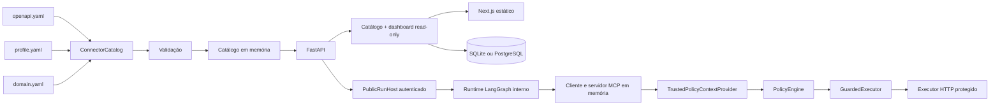
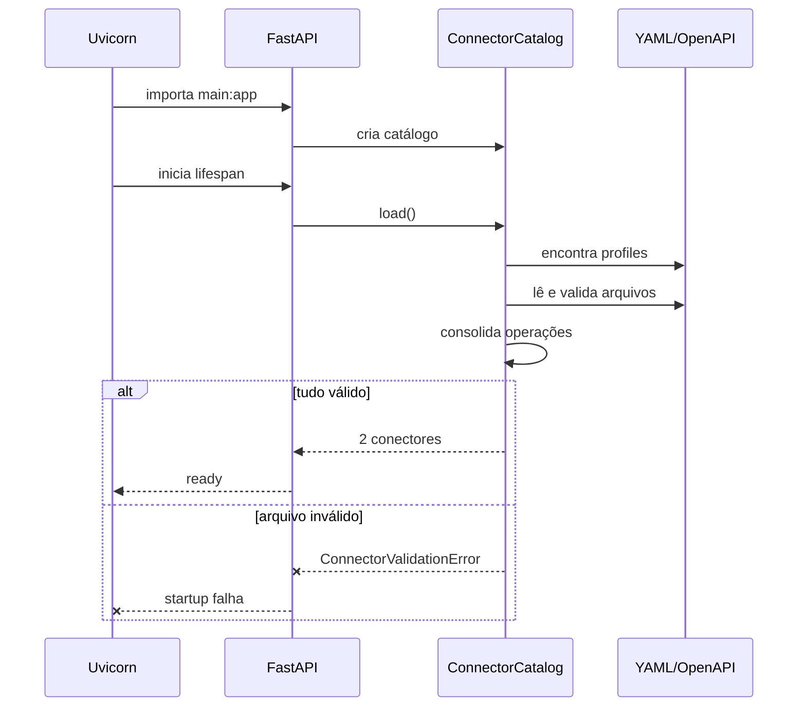
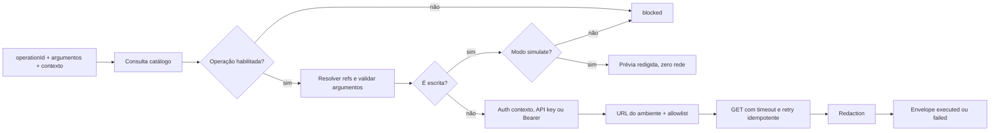

# Guia completo do IndusGuard

> Documento único para entender o projeto desde o problema até o código atual.
>
> Última atualização: 24 de agosto de 2026.

## 1. Como usar este guia

Este guia foi escrito para ser lido em ordem. Você não precisa começar abrindo o maior arquivo do
projeto nem precisa dominar LangGraph, MCP ou deployment antes de entender as camadas básicas.

A ordem recomendada é:

1. entender o que estamos construindo;
2. entender o que já existe e o que ainda não existe;
3. aprender o papel de OpenAPI, `profile.yaml` e `domain.yaml`;
4. acompanhar o caminho executado pelo Python;
5. rodar a aplicação e observar as respostas;
6. ler os testes como regras do sistema;
7. estudar executor, policy engine, MCP e runtime LangGraph junto com seus testes.

Se alguma seção parecer abstrata, avance até o laboratório prático e volte depois. Ver o sistema
funcionando costuma tornar os conceitos mais concretos.

---

## 2. O projeto em linguagem simples

O IndusGuard será uma plataforma para agentes de IA que usam APIs externas com segurança.

Imagine que uma pessoa pergunta:

> “O motor está vibrando demais. Verifique os dados e, se for necessário, solicite uma nova
> análise.”

Um agente precisa decidir:

1. qual API consultar;
2. qual endpoint usar;
3. quais argumentos enviar;
4. se possui evidência suficiente;
5. se a pessoa tem permissão;
6. se a ação precisa de confirmação;
7. se deve apenas orientar, executar ou escalar para um humano.

Um LLM não deve controlar sozinho todas essas decisões. Ele é probabilístico: duas execuções podem
produzir planos diferentes. Por isso o IndusGuard colocará uma camada determinística entre o modelo
e a API.

Essa camada dirá, por código:

- quais endpoints existem;
- quais estão habilitados;
- quais são leitura ou escrita;
- qual o risco de cada operação;
- quais permissões são necessárias;
- quando exigir justificativa ou confirmação;
- quais dados devem ser removidos dos traces.

### A frase mais importante deste guia

**OpenAPI informa o que uma API consegue fazer; o profile informa o que o agente tem permissão para
fazer.**

---

## 3. O que já existe e o que ainda não existe

O projeto está sendo construído por camadas.

### Implementado

- monorepo no GitHub;
- backend Python 3.12 com FastAPI;
- configuração por variáveis de ambiente;
- modelos Pydantic para validar profiles;
- descoberta automática de conectores;
- validação OpenAPI 3.x;
- detecção de chaves YAML duplicadas;
- classificação determinística de leitura e escrita;
- conector Tractian com 18 operações;
- conector sintético com 2 operações;
- endpoints de saúde, versão, conectores e operações;
- catálogo com visão pública e metadados internos de execução separados;
- executor interno de operações GET e simulação de escritas;
- validação JSON Schema de path, query, headers e body;
- resolução local de `$ref` para parâmetros e schemas;
- autenticação `context_header`, API key em header/query e Bearer;
- URL-base por ambiente conferida contra allowlist;
- retry de falhas transitórias condicionado por idempotência;
- redaction recursiva de campos e credenciais refletidas;
- envelope comum para execução, simulação, bloqueio e falha;
- policy engine determinística, genérica e configurada pelo profile;
- verificação de identidade, permissões, escopos, pedido direto e justificativa;
- digest SHA-256 para vincular confirmação à pessoa e à ação exata;
- `GuardedExecutor` que impede rede em bloqueios e confirmações pendentes;
- servidor MCP v2 interno, sem porta ou subprocesso;
- uma tool por operação habilitada, totalizando 20 tools nos conectores atuais;
- schemas MCP específicos e autocontidos, gerados do OpenAPI;
- annotations de leitura, potencial destrutivo, idempotência e acesso externo;
- provider assíncrono para identidade, permissões, escopos e confirmação confiáveis;
- cliente MCP real em memória atravessando policy engine e executor nos testes;
- `domain.yaml` inteiramente tipado, com intenções e referências de operações validadas;
- runtime LangGraph stateless com classificação, planejamento, tools e finalização explícitos;
- aliases de tools isolados por conector e resolvidos internamente para nomes MCP;
- contexto confiável da run separado da mensagem controlada pela pessoa/modelo;
- evidências redigidas, limitadas e identificadas como `ev-001`, `ev-002` etc.;
- limites de 8 chamadas de modelo, 12 tools, 60 segundos, 32 KiB por evidência e 128 KiB por run;
- modelo fake determinístico para testes e CI;
- adapter opcional da Groq Free com `openai/gpt-oss-20b`, sem fallback pago ou Ollama;
- testes automatizados;
- CI com Ruff, pytest e cobertura;
- `PublicRunHost` como única interface HTTP do agente;
- Bearer exclusivo do proprietário com comparação em tempo constante;
- quota persistente de três runs por hora e limite de duas simultâneas;
- conector público `synthetic` executado por ASGI interno, sem fixture industrial;
- `POST /api/v1/runs` stateless com escritas sempre simuladas;
- projeção autenticada sem token, confirmação ou digest.
- piloto Groq limitado a 12 runs, com consentimento explícito e resume idempotente;
- preflight sem rede com manifesto vinculado a commit, corpus, modelo e agenda;
- imagem Docker multi-stage não-root, migração antes do Uvicorn e smoke de readiness;
- Blueprint Render para backend Docker e frontend estático;
- URL Neon atual validada com TLS e channel binding via Psycopg 3;
- SBOM SPDX e scan de vulnerabilidades altas/críticas no CI.

### Ainda não implementado

- execução real de escritas;
- contas multiusuário e OAuth;
- execução efetiva do piloto Groq com a chave do proprietário;
- recursos públicos provisionados no Render, Neon ou Grafana.

Ao iniciar o FastAPI, o catálogo e o dashboard continuam públicos e read-only. A única execução do
agente é `POST /runs`, restrita ao token do proprietário e ao conector `synthetic`. A suíte usa
modelo fake e MCP real em memória; nenhum teste padrão chama Groq.

Isso é intencional. Estamos construindo primeiro a fundação previsível.

---

## 4. Uma analogia para entender a arquitetura

Pense em um restaurante:

| Projeto | Analogia |
|---|---|
| API externa | A cozinha, que realmente produz algo. |
| OpenAPI | O cardápio técnico: pratos, opções e formatos. |
| `profile.yaml` | As regras do restaurante: quem pode pedir, limites e confirmações. |
| `domain.yaml` | O glossário usado pelos atendentes para entender os pedidos. |
| Pydantic | O formulário que rejeita pedidos preenchidos incorretamente. |
| `ConnectorCatalog` | A pessoa que confere cardápio e regras antes de abrir o restaurante. |
| FastAPI | O balcão que expõe as informações já conferidas. |
| Executor atual | O garçom que leva GETs à cozinha e ensaia escritas sem entregá-las. |
| Policy engine atual | O supervisor que permite, simula, pede confirmação ou bloqueia. |
| Servidor MCP atual | A comanda padronizada que traduz o pedido para o supervisor. |
| Agente futuro | O atendente que conversa e sugere o que pedir. |

Hoje temos cardápio, regras, glossário, conferência, comanda MCP, supervisor, percursos GET e
simulação de escrita, inclusive com quatro estratégias de autenticação. Ainda não implementamos
escrita real nem o atendente inteligente.

---

## 5. Glossário essencial

### API

Uma interface usada por sistemas para trocar dados. Exemplo:

```text
GET /assets/asset_M101
```

Essa chamada pede os dados do ativo `asset_M101`.

### Endpoint

Uma combinação de método HTTP e caminho.

```text
GET   /assets/{assetId}   -> consulta um ativo
PATCH /assets/{assetId}   -> altera um ativo
```

O mesmo caminho pode ter comportamentos diferentes conforme o método.

### OpenAPI

Um documento YAML ou JSON que descreve uma API: endpoints, parâmetros, bodies, schemas e respostas.

Trecho simplificado:

```yaml
paths:
  /assets/{assetId}:
    get:
      operationId: getAsset
      responses:
        "200":
          description: Ativo encontrado
```

### `operationId`

Nome estável de uma operação no OpenAPI. O path pode mudar, mas o sistema usa esse nome para ligar
o endpoint às políticas.

Exemplos:

- `getAsset`;
- `updateAssetConfig`;
- `requestRetraining`.

### YAML

Formato textual de configuração baseado em indentação.

```yaml
enabled: true
risk: high
```

Espaços importam. Tabs não devem ser usados em YAML.

### Conector

Pasta com os arquivos necessários para integrar uma API:

```text
openapi.yaml
profile.yaml
domain.yaml
```

### Catálogo

Representação em memória dos conectores e operações que passaram por todas as validações.

### Pydantic

Biblioteca que transforma dados recebidos em objetos Python tipados e rejeita formatos inválidos.

### FastAPI

Framework que cria endpoints HTTP a partir de funções Python e modelos Pydantic.

### MCP

Model Context Protocol. É um protocolo para um host descobrir e chamar tools por contratos
padronizados. No projeto, ele é a interface entre o runtime LangGraph e as operações protegidas.

### Tool MCP

Uma operação nomeada com `inputSchema`, `outputSchema` e annotations. Exemplo:
`synthetic.getWidget`. Tool descreve como chamar; não concede autorização por si só.

### Provider confiável

Componente do runtime autenticado que fornece identidade, permissões, escopos, pedido direto e
confirmação. Esses sinais ficam fora dos argumentos que o modelo pode produzir.

### Fail-fast

Falhar imediatamente ao detectar configuração inválida. É melhor impedir o startup do que subir um
serviço com operações faltando ou políticas incorretas.

### Liveness

Responde à pergunta: “o processo HTTP está vivo?”

### Readiness

Responde à pergunta: “o processo terminou de carregar tudo e está pronto para receber tráfego?”

### Idempotência

Uma operação idempotente pode ser repetida sem multiplicar seu efeito. Consultas GET normalmente
são idempotentes. Criar a mesma ordem duas vezes normalmente não é.

### Redaction

Remoção de campos sensíveis antes de armazenar ou exibir traces.

### Drift de contrato

Diferença inesperada entre OpenAPI, profile, backend, frontend ou API real.

---

## 6. Estrutura do repositório

```text
indusguard/
├── .github/
│   └── workflows/
│       └── ci.yml
├── apps/
│   ├── api/
│   │   ├── src/
│   │   │   └── indusguard_api/
│   │   │       ├── __init__.py
│   │   │       ├── settings.py
│   │   │       ├── schemas.py
│   │   │       ├── connectors.py
│   │   │       ├── executor.py
│   │   │       ├── policy.py
│   │   │       ├── mcp_server.py
│   │   │       └── main.py
│   │   ├── tests/
│   │   │   ├── conftest.py
│   │   │   ├── test_connectors.py
│   │   │   ├── test_executor.py
│   │   │   ├── test_policy.py
│   │   │   ├── test_mcp_server.py
│   │   │   └── test_system.py
│   │   └── pyproject.toml
│   └── web/
├── connectors/
│   ├── tractian/
│   │   ├── openapi.yaml
│   │   ├── profile.yaml
│   │   └── domain.yaml
│   └── synthetic/
│       ├── openapi.yaml
│       ├── profile.yaml
│       └── domain.yaml
├── deploy/
├── docs/
├── evals/
├── .env.example
├── Makefile
└── README.md
```

### Pastas que importam agora

- `apps/api/src/indusguard_api`: código executado;
- `apps/api/tests`: regras protegidas pelos testes;
- `apps/web`: dashboard Next.js estático;
- `connectors`: APIs e políticas carregadas.

### Pastas que podem ser ignoradas por enquanto

- `deploy`: imagem e configuração declarativa; nenhum recurso externo criado;
- `evals`: corpus oficial isolado, fixture Parquet, baseline, runner, scorer e revisão humana.

---

## 7. Arquitetura atual



Todas as linhas representam o que existe hoje. O MCP e o executor permanecem internos; somente o
`PublicRunHost` pode iniciar o agente pela API. As páginas atuais do dashboard continuam lendo
apenas metadados persistidos.

---

## 8. Os três arquivos de um conector

### 8.1 `openapi.yaml`: capacidade técnica

O OpenAPI responde:

- qual método HTTP usar;
- qual o path;
- quais parâmetros existem;
- qual JSON enviar;
- qual resposta esperar.

Exemplo sintético:

```yaml
openapi: 3.1.0
info:
  title: Widget API
  version: 0.1.0

paths:
  /widgets/{widgetId}:
    get:
      operationId: getWidget
      parameters:
        - name: widgetId
          in: path
          required: true
          schema:
            type: string
      responses:
        "200":
          description: Widget encontrado
```

Esse arquivo não diz se o agente deve ter permissão para usar `getWidget`. Ele só diz que a API
oferece essa operação.

#### Restrições atuais do IndusGuard

O loader aceita:

- OpenAPI 3.0 e 3.1;
- APIs REST;
- request e response JSON;
- referências locais como `#/components/schemas/Widget`.

O loader recusa:

- OpenAPI 2;
- `$ref` para URL ou outro arquivo;
- conteúdo binário;
- upload;
- respostas não JSON;
- GraphQL;
- gRPC;
- WebSocket;
- OAuth interativo.

Essas restrições mantêm a primeira versão pequena e segura.

### 8.2 `profile.yaml`: política local

O profile responde:

- qual o ID do conector;
- onde encontrar o OpenAPI;
- de qual variável vem a URL;
- quais URLs são permitidas;
- como autenticar;
- quais operações estão habilitadas;
- quais permissões e confirmações são exigidas.

Exemplo:

```yaml
id: synthetic
name: API sintética
description: API usada para testar a arquitetura
openapi: ./openapi.yaml

base_url_env: SYNTHETIC_API_URL
allowed_base_urls:
  - http://localhost:9000

auth:
  type: none

operations:
  getWidget:
    enabled: true
    access: read
    risk: low
    timeout_seconds: 5
    max_retries: 2
    idempotent: true

  updateWidget:
    enabled: true
    access: write
    risk: high
    permission: action_high
    requires_direct_request: true
    requires_confirmation: true
    justification_min_length: 20
```

#### Campos de operação

| Campo | Significado |
|---|---|
| `enabled` | Informa se o agente poderá usar a operação. |
| `access` | `read` ou `write`. |
| `risk` | `low`, `medium`, `high` ou `critical`. |
| `permission` | Permissão de domínio necessária. |
| `requires_direct_request` | A pessoa deve ter solicitado a ação explicitamente. |
| `requires_confirmation` | A ação precisa de confirmação adicional. |
| `justification_min_length` | Tamanho mínimo da justificativa. |
| `timeout_seconds` | Limite de espera da chamada futura. |
| `max_retries` | Quantidade máxima de novas tentativas. |
| `idempotent` | Informa se repetir é seguro. |
| `redact_fields` | Campos que deverão desaparecer dos traces. |

#### Por que `enabled` começa como `false`?

Imagine que uma API externa adicione amanhã:

```text
DELETE /users/{id}
```

Se o OpenAPI for atualizado automaticamente, o agente não deve ganhar acesso ao DELETE apenas
porque o endpoint apareceu. Alguém precisa revisar e habilitar a operação conscientemente.

#### Tipos de autenticação suportados pelo executor

| Tipo | Uso atual |
|---|---|
| `none` | API sem autenticação. |
| `api_key_header` | API key em um header. |
| `api_key_query` | API key na query string. |
| `bearer` | Bearer token no header Authorization. |
| `context_header` | Header criado a partir do contexto, como `user_id`. |

Os schemas validam todas essas opções e o executor as aplica. API keys e tokens são lidos apenas da
variável indicada por `env`; argumentos não podem substituir autenticação reservada, e segredos não
entram no envelope.

### 8.3 `domain.yaml`: significado do domínio

O domain responde:

- qual o idioma principal;
- quais campos formam o contexto;
- qual o significado dos termos;
- quais intenções existem;
- quais operações ajudam cada intenção.

Exemplo:

```yaml
id: tractian
language: pt-BR

context_fields:
  - user_id
  - company_id
  - asset_id
  - case_id

terminology:
  asset: ativo industrial monitorado
  baseline: estado normal aprendido para um ativo

intents:
  - id: investigar
    description: Consultar sinais, análises e qualidade
    evidence_operations:
      - getAnalysis
      - getBaseline
      - getDataQuality
```

Hoje o loader valida principalmente `context_fields`. Terminologia e intenções serão consumidas
pelo agente e pela interface em etapas futuras.

---

## 9. O backend Python, arquivo por arquivo

Leia os arquivos nesta ordem:

```text
settings.py -> schemas.py -> connectors.py -> executor.py -> policy.py -> mcp_server.py -> main.py
```

### 9.1 `__init__.py`

Contém a versão pública:

```python
__version__ = "0.1.0"
```

O endpoint `/version` usa essa mesma variável. Ter uma fonte única evita que o pacote diga uma
versão e a API diga outra.

### 9.2 `settings.py`

Responsabilidade: obter configurações do ambiente.

Versão simplificada:

```python
class Settings(BaseSettings):
    model_config = SettingsConfigDict(
        env_file=".env",
        env_prefix="INDUSGUARD_",
        extra="ignore",
    )

    environment: str = "development"
    execution_mode: Literal["simulate", "execute"] = "simulate"
    connectors_dir: Path = Field(default_factory=default_connectors_dir)
    api_prefix: str = "/api/v1"
```

#### Como o prefixo funciona

O campo Python:

```text
execution_mode
```

é configurado pela variável:

```text
INDUSGUARD_EXECUTION_MODE
```

#### Por que o default é `simulate`?

Uma instalação nova nunca deve executar mutações reais por acidente. Será necessário escolher
`execute` conscientemente em um ambiente controlado.

#### Por que calcular `connectors_dir` a partir do arquivo?

Para não depender do diretório em que o terminal foi aberto. O código localiza a raiz do monorepo
a partir da posição de `settings.py`.

### 9.3 `schemas.py`

Responsabilidade: declarar os formatos válidos usando Pydantic.

#### `AccessMode`

```python
class AccessMode(StrEnum):
    READ = "read"
    WRITE = "write"
```

Evita strings arbitrárias como `reading`, `edit` ou `mutation`.

#### `RiskLevel`

```python
class RiskLevel(StrEnum):
    LOW = "low"
    MEDIUM = "medium"
    HIGH = "high"
    CRITICAL = "critical"
```

É exposto pela policy engine para decisão, explicação e futuros release gates.

#### `AuthProfile`

Valida autenticação.

Exemplos de regras:

- API key exige `name` e `env`;
- Bearer exige `env`;
- header de contexto exige `name` e `context_field`.

Se faltar um desses campos, o conector não carrega.

#### `OperationPolicy`

Representa as regras de uma operação. Seus defaults são conservadores:

```python
enabled = False
timeout_seconds = 10
max_retries = 0
idempotent = False
required_scopes = []
justification_pointer = "/justification"
```

Os limites Pydantic também impedem:

- timeout acima de 60 segundos;
- mais de 2 retries;
- justificativa negativa ou exageradamente grande.

#### `ConnectorProfile`

Representa todo o `profile.yaml`.

O `id` precisa corresponder ao padrão:

```text
^[a-z][a-z0-9_-]*$
```

Portanto:

- `tractian` é válido;
- `my_api` é válido;
- `2api` é inválido;
- `Minha API` é inválido.

#### `extra="forbid"`

Os profiles rejeitam campos desconhecidos.

Se alguém escrever:

```yaml
max_retry: 2
```

em vez de:

```yaml
max_retries: 2
```

o startup falha. Isso evita ignorar um erro de digitação que poderia alterar segurança.

#### Modelos de resposta

- `OperationSummary`: operação consolidada;
- `ConnectorSummary`: resumo sem operações;
- `ConnectorDetails`: resumo com operações;
- `HealthResponse`: resposta de liveness;
- `ReadyResponse`: resposta de readiness;
- `VersionResponse`: versão e modo.
- `PolicyPrincipal`: identidade, permissões e escopos confiáveis;
- `PolicyConfirmation`: pessoa confirmadora e digest da ação;
- `PolicyEvaluationRequest`: proposta de execução mais sinais do runtime;
- `PolicyDecision`: outcome e códigos estáveis sem dados brutos;
- `GuardedExecutionResult`: decisão e resultado HTTP opcional.

### 9.4 `connectors.py`

Este é o principal arquivo da etapa atual.

Responsabilidade: transformar arquivos declarativos em catálogo validado.

#### Constantes de métodos HTTP

```python
HTTP_METHODS = {
    "get", "post", "put", "patch",
    "delete", "head", "options", "trace"
}

READ_METHODS = {"get", "head", "options"}
```

Um path OpenAPI também pode conter campos como `parameters`. A lista `HTTP_METHODS` impede que o
loader trate esses campos como endpoints.

#### `ConnectorValidationError`

Erro próprio do domínio. Em vez de espalhar erros de YAML, Pydantic e OpenAPI, o módulo apresenta
mensagens relacionadas à configuração do conector.

#### `UniqueKeyLoader`

O comportamento comum de muitos parsers YAML é conservar apenas a última chave repetida.

Exemplo problemático:

```yaml
paths:
  /assets/{assetId}:
    get: {}

  /assets/{assetId}:
    patch: {}
```

Um parser pode apagar o GET e manter apenas o PATCH. Isso ocorreu no contrato originalmente
fornecido pelos stakeholders.

O `UniqueKeyLoader` percorre o mapa e lança erro quando a chave já existe. Assim o problema aparece
no startup, em vez de uma tool desaparecer silenciosamente.

O contrato Tractian versionado foi normalizado para:

```yaml
paths:
  /assets/{assetId}:
    get: {}
    patch: {}
```

#### `_load_yaml`

Responsabilidades:

1. abrir o arquivo em UTF-8;
2. usar `UniqueKeyLoader`;
3. transformar erros em `ConnectorValidationError`;
4. garantir que a raiz seja um objeto YAML.

#### `_walk`

Percorre recursivamente mapas e listas.

É usado para procurar `$ref`, `format: binary` ou `format: byte` em qualquer nível do OpenAPI.

#### `_validate_runtime_constraints`

Executa duas famílias de validação.

##### Regras do IndusGuard

- OpenAPI precisa começar com `3.`;
- `$ref` precisa começar com `#/`;
- formatos binários são proibidos;
- content types precisam ser JSON.

##### Validação oficial do OpenAPI

Depois das regras locais, `openapi-spec-validator` verifica a estrutura da especificação.

#### `_operation_access`

Classifica automaticamente:

- GET, HEAD e OPTIONS como leitura;
- os demais métodos como escrita.

Essa decisão é código determinístico, não interpretação do LLM.

#### `_operation_risk`

Fornece um default conservador:

- leitura -> risco baixo;
- escrita -> risco alto.

O profile pode declarar risco mais específico.

#### `_build_operation`

Combina duas fontes:

```text
OpenAPI                    profile.yaml
-----------------------    --------------------------
operationId                enabled
método                     risk
path                       permission
summary                    confirmation
tags                       timeout/retry
```

O resultado é um `OperationSummary`.

O método também rejeita contradição como:

```yaml
POST /orders
access: read
```

POST é classificado como escrita, então o conector falha.

#### `_parse_operations`

Percorre todos os paths e métodos do OpenAPI.

Para cada operação:

1. verifica se há `operationId`;
2. rejeita IDs duplicados;
3. procura a política correspondente;
4. usa uma política desabilitada quando ela não existe;
5. constrói o resumo consolidado.

Ao final, também verifica o caminho oposto: se o profile mencionar uma operação que não existe no
OpenAPI, o conector falha.

Isso detecta drift e typos.

#### `ConnectorCatalog`

É a classe que coordena tudo.

Estado interno:

```python
self.connectors_dir
self._connectors
```

##### `load()`

Fluxo:

```text
procura */profile.yaml
    -> carrega conector 1
    -> carrega conector 2
    -> verifica IDs duplicados
    -> substitui o catálogo somente no final
```

O catálogo novo é montado em uma variável temporária. Se o segundo conector falhar, o estado atual
não é substituído por um catálogo pela metade.

Os profiles são ordenados antes da leitura para que Linux, macOS e CI produzam a mesma ordem.

##### `_load_connector()`

Passo a passo:

1. lê `profile.yaml`;
2. valida com `ConnectorProfile`;
3. compara ID e nome da pasta;
4. resolve o caminho do OpenAPI;
5. impede que `../` escape da pasta;
6. lê e valida o OpenAPI;
7. extrai operações;
8. lê `domain.yaml`;
9. valida `context_fields`;
10. constrói `ConnectorDetails`, que é a visão pública;
11. preserva profile e parâmetros em `LoadedConnector`, que é a visão interna.

##### `list()`

Devolve resumos sem operações detalhadas. É usado pela listagem `/connectors`.

##### `get()`

Devolve uma cópia profunda do conector.

Por quê? Se uma rota recebesse o objeto original e alterasse `enabled`, ela corromperia o catálogo
compartilhado por todos os requests seguintes.

##### `resolve_operation()`

Entrega ao executor uma cópia dos metadados internos necessários:

- profile do conector, incluindo nome da variável de URL e allowlist;
- resumo consolidado da operação;
- parâmetros OpenAPI combinados e com Reference Objects resolvidos;
- request body da operação, quando existir;
- documento OpenAPI raiz para resolver `$ref` dentro dos schemas.

Separar `get()` de `resolve_operation()` evita que as rotas públicas recebam metadados internos de
execução sem necessidade.

### 9.5 `main.py`

Responsabilidade: criar a aplicação FastAPI e expor o catálogo.

#### `create_app`

É uma application factory:

```python
def create_app(*, connectors_dir: Path | None = None) -> FastAPI:
```

Em produção ela usa o diretório configurado. Nos testes ela pode receber uma pasta temporária.

Sem factory, os testes precisariam modificar estado global.

#### Lifespan

```python
@asynccontextmanager
async def lifespan(_: FastAPI):
    catalog.load()
    yield
```

O código antes do `yield` roda no startup. O catálogo precisa carregar antes de a aplicação ficar
pronta.

Se um conector for inválido, o startup falha. Isso é fail-fast.

#### `application.state`

```python
application.state.settings = settings
application.state.connector_catalog = catalog
```

Guarda objetos construídos uma vez para que as rotas não recriem configuração e catálogo em cada
request.

#### Rotas atuais

##### `GET /api/v1/health`

Resposta:

```json
{"status": "healthy"}
```

Confirma que o processo HTTP responde.

##### `GET /api/v1/ready`

Resposta:

```json
{
  "status": "ready",
  "connector_count": 2
}
```

Confirma que o startup terminou e informa quantos conectores carregaram.

##### `GET /api/v1/version`

Resposta:

```json
{
  "version": "0.1.0",
  "environment": "development",
  "execution_mode": "simulate"
}
```

Esses dados serão importantes para correlacionar traces e releases.

##### `GET /api/v1/connectors`

Lista os conectores sem revelar credenciais ou URLs resolvidas.

##### `GET /api/v1/connectors/{connector_id}/operations`

Lista operações consolidadas. Se o conector não existir, retorna 404.

#### Variável global `app`

```python
app = create_app()
```

O Uvicorn procura `indusguard_api.main:app`. A factory continua disponível para os testes.

### 9.6 `executor.py`

Responsabilidade: transformar uma operação conhecida em uma chamada GET validada e autenticada.

Entrada:

```json
{
  "connector_id": "tractian",
  "operation_id": "getAsset",
  "arguments": {
    "path": {"assetId": "asset_M101"},
    "query": {"seed": "case-01"},
    "headers": {}
  },
  "context": {"user_id": "usr_001"}
}
```

Fluxo de `HttpExecutor.execute()`:

1. verifica se conector e operação existem;
2. exige que a operação esteja habilitada;
3. resolve referências locais de parâmetros;
4. valida nomes, obrigatoriedade e schemas de path, query e headers;
5. valida body JSON quando declarado;
6. aplica percent-encoding e serialização OpenAPI previsível;
7. separa leitura de escrita;
8. simula escrita no modo seguro ou exige a composição protegida no modo `execute`;
9. aplica `context_header`, API key ou Bearer sem aceitar sobrescrita;
10. lê a URL-base da variável indicada pelo profile e confere a allowlist;
11. executa GET com timeout e retry apenas quando a operação é idempotente;
12. redige campos sensíveis e normaliza o resultado.

`context_header` liga três configurações:

```text
profile.auth.context_field = user_id
        -> request.context.user_id = usr_001
        -> header x-user-id: usr_001
```

O valor não vem de `arguments.headers`; isso impediria confiar na identidade escolhida pelo agente.

Os outcomes são:

| Outcome | Significado |
|---|---|
| `executed` | A API respondeu com HTTP 2xx. |
| `blocked` | Uma regra determinística impediu acesso à rede. |
| `failed` | A chamada permitida teve timeout, erro HTTP ou resposta inválida. |
| `simulated` | Uma escrita válida virou uma prévia redigida e realizou zero chamadas. |

O envelope também possui `attempts`: bloqueio e simulação usam zero; chamadas HTTP informam quantas
tentativas realmente ocorreram. `simulation` contém método, path relativo, query sem autenticação,
nomes de headers e body redigido. URL-base e valores de autenticação nunca entram nessa prévia.

O executor recebe `operationId`, não URL. Essa é uma defesa importante contra SSRF: o destino vem
do ambiente e precisa coincidir com a allowlist versionada.

O `httpx.AsyncClient` e o mapa de variáveis de ambiente podem ser injetados. Nos testes, isso
substitui a internet por `httpx.MockTransport` sem criar caminhos especiais no código de produção.

---

### 9.7 `policy.py`

Responsabilidade: decidir se uma proposta pode chegar ao executor HTTP. A policy engine não usa
LLM, banco nem rede; por isso, a mesma entrada sempre produz a mesma decisão.

Entrada conceitual:

```text
PolicyEvaluationRequest
├── execution              # conector, operação, argumentos e contexto
├── principal              # identidade, permissões e escopos autenticados
├── resource_scopes        # vínculo comprovado do recurso
├── direct_request         # a pessoa pediu explicitamente esta ação?
└── confirmation           # pessoa + digest, somente quando houver
```

`principal` e `resource_scopes` são sinais confiáveis do runtime. Futuramente, poderão ser
preenchidos por autenticação, `getCurrentUser` e consultas ao recurso. O modelo de linguagem nunca
escolherá permissões, empresa ou confirmação.

Fluxo de `PolicyEngine.evaluate()`:

1. resolve conector e operação no catálogo;
2. bloqueia operação ausente ou desabilitada;
3. confere a identidade contra o `context_field` da autenticação;
4. para cada `required_scope`, exige o mesmo valor e o mesmo tipo no principal, recurso e contexto;
5. confere a permissão declarada no profile;
6. valida pedido direto quando obrigatório;
7. localiza a justificativa pelo `justification_pointer` e conta caracteres após `strip()`;
8. calcula o digest para escritas;
9. devolve `allow`, `simulate`, `require_confirmation` ou `block`.

O JSON Pointer desacopla o núcleo do body de cada API. O default é `/justification`, enquanto uma
API diferente poderia declarar `/metadata/reasons/0/text` apenas no YAML.

O digest usa JSON canônico e SHA-256 sobre conector, operação, argumentos, contexto, principal e
escopos do recurso. A decisão expõe somente os 64 caracteres do hash. Se qualquer parte mudar, a
confirmação anterior deixa de corresponder à ação.

#### Diferença entre simular, confirmar e executar

| Situação | Resultado atual | Rede |
|---|---|---:|
| Leitura aprovada | `allow`, depois GET no `HttpExecutor` | 1 ou mais tentativas por retry |
| Escrita em `simulate` | `simulate`, depois prévia validada | 0 |
| Escrita em `execute` sem a confirmação exigida | `require_confirmation` | 0 |
| Confirmação de outra pessoa ou digest | `require_confirmation` | 0 |
| Confirmação válida | `block/REAL_WRITE_DISABLED` | 0 |

Simulação não exige confirmação porque não produz efeito externo. O campo
`confirmation_required_for_execute=true` informa que a mesma ação precisaria de aceite para uma
execução futura. Confirmação válida também não é autorização suficiente neste incremento: o
bloqueio final evita ativar escrita real acidentalmente.

`GuardedExecutor` combina a engine com o HTTP. Sua construção falha se os dois componentes usam
modos diferentes, e seu método só chama `HttpExecutor` para leitura `allow` ou escrita `simulate`.

---

### 9.8 `mcp_server.py`

Responsabilidade: apresentar as operações habilitadas como tools padronizadas sem criar um atalho
em torno da policy engine.

#### Por que o MCP é interno?

Neste incremento, `create_mcp_server()` devolve um objeto `Server` do SDK v2. Ele não abre porta,
não inicia subprocesso e não cria `/mcp` no FastAPI. O runtime LangGraph usa esse mesmo objeto como
cliente em memória; o transporte continua interno e não é uma rota de produto.

#### O que acontece na construção

1. o catálogo fornece conectores e operações;
2. operações com `enabled: false` são omitidas;
3. cada nome vira `connector_id.operationId`;
4. nomes fora de `[A-Za-z0-9._-]`, maiores que 128 caracteres ou colidindo falham no startup;
5. os argumentos OpenAPI viram um `inputSchema` fechado;
6. `GuardedExecutionResult` vira a base do `outputSchema`;
7. a lista é congelada até o próximo restart.

Os conectores atuais produzem 20 tools: 18 Tractian e 2 synthetic. Adicionar outra pasta de
conector produz novas tools sem editar Python ou TypeScript.

#### Como o schema é gerado

Uma operação como `synthetic.getWidget` publica, de forma simplificada:

```json
{
  "type": "object",
  "properties": {
    "path": {
      "type": "object",
      "properties": {"widgetId": {"type": "string"}},
      "required": ["widgetId"],
      "additionalProperties": false
    },
    "query": {
      "type": "object",
      "properties": {
        "labels": {"type": "array", "items": {"type": "string"}}
      },
      "additionalProperties": false
    }
  },
  "required": ["path"],
  "additionalProperties": false
}
```

Path, query, headers e body permanecem separados porque um mesmo nome pode existir em posições
diferentes. `$ref` local não pode continuar apontando para o OpenAPI inteiro, que não é enviado ao
cliente. `_SchemaBundler` copia apenas as definições necessárias para `$defs` e reescreve o
apontador, deixando o schema MCP autocontido.

As annotations comunicam intenção ao host:

| Annotation | Origem |
|---|---|
| `readOnlyHint` | `access == read` |
| `destructiveHint` | `access == write`, mesmo que hoje seja simulado |
| `idempotentHint` | `idempotent` do profile |
| `openWorldHint` | `true`, pois a tool conversa com uma API externa |

Annotations ajudam o planejamento, mas não autorizam nada. A policy engine continua sendo o gate.

#### A fronteira confiável

O cliente fornece apenas os argumentos técnicos descritos pelo OpenAPI. Ele não consegue enviar:

- `principal`;
- permissões ou escopos;
- `direct_request`;
- confirmação;
- `connector_id`, `operation_id` ou URL;
- credenciais.

Depois que os argumentos passam no JSON Schema, `TrustedPolicyContextProvider.resolve()` recebe o
conector, a operação e um `ExecutionArguments` já validado. Ele devolve `TrustedPolicySignals`.
O agente implementa `RunBoundTrustedContextProvider`, que liga as chamadas ao
`TrustedRunContext` da run. Ausência ou falha produz `TRUSTED_CONTEXT_UNAVAILABLE`; jamais existe
fallback para valores escolhidos pelo LLM.

#### O que acontece em uma chamada

```text
call_tool(nome, argumentos)
    -> localizar tool no snapshot
    -> validar inputSchema
    -> consultar TrustedPolicyContextProvider
    -> construir PolicyEvaluationRequest
    -> chamar somente GuardedExecutor.execute()
    -> devolver GuardedExecutionResult em structuredContent
```

`allow`, `simulate`, `block`, `require_confirmation` e falha do upstream são resultados normais,
com `isError=false`. Isso permite que o agente entenda “a política negou” sem confundir com
“o protocolo quebrou”. `isError=true` é reservado para:

- `MCP_TOOL_NOT_FOUND`;
- `MCP_TOOL_ARGUMENTS_INVALID`;
- `TRUSTED_CONTEXT_UNAVAILABLE`;
- `MCP_TOOL_INTERNAL_ERROR`.

Esses erros são redigidos: não repetem argumentos, segredos, mensagens internas ou stack trace.

---

## 10. Fluxo completo de startup



---

## 11. Testes: regras executáveis do projeto

Comentários e documentação podem ficar desatualizados. Um teste executável reduz esse risco.

### 11.1 `conftest.py`

Cria `ASGITestClient` usando `httpx.ASGITransport`.

Isso permite chamar o FastAPI em memória:

- nenhuma porta é aberta;
- nenhum servidor externo é necessário;
- os testes são rápidos;
- o lifespan continua sendo executado.

Cada teste recebe uma aplicação nova para evitar vazamento de estado.

### 11.2 `test_system.py`

Protege:

1. resposta de health;
2. readiness com dois conectores;
3. default `simulate`.

O terceiro teste é uma regra de segurança: uma instalação nova não começa executando mutações.

### 11.3 `test_connectors.py`

Protege:

1. descoberta de Tractian e synthetic;
2. Tractian com 18 operações;
3. synthetic com 2 operações;
4. presença simultânea de GET e PATCH em `/assets/{assetId}`;
5. permissão e confirmação da escrita de configuração;
6. 404 para conector desconhecido;
7. operações sem profile desabilitadas;
8. rejeição de YAML duplicado;
9. `context_header` apontando somente para campo declarado no domínio.

### 11.4 `test_executor.py`

Seus 46 casos comprovam:

- GET sintético e envelope comum;
- GET Tractian com path, query por `$ref` e autenticação de contexto;
- arrays em query e headers declarados no OpenAPI;
- percent-encoding de valores do path;
- ausência, excesso, enum e tipo incorreto de argumentos;
- conector, operação e configuração ausentes;
- operação desabilitada, escrita simulada e escrita real bloqueada no executor direto;
- URL fora da allowlist;
- body ausente/inválido e referências aninhadas;
- identidade ausente, forjada ou contendo quebra de linha;
- API key em header/query e Bearer sem vazamento de credenciais;
- retry de timeout, conexão, 429 e 5xx somente para operação idempotente;
- redaction recursiva em resposta e prévia de simulação;
- timeout, erro de conexão, HTTP 503 e resposta não JSON.

Todos usam `httpx.MockTransport`; nenhum teste acessa a internet.

### 11.5 `test_policy.py`

Seus 23 casos comprovam:

- leitura permitida e identidade divergente bloqueada;
- operação ausente ou desabilitada;
- permissão, pedido direto e justificativa;
- JSON Pointer aninhado;
- escopo ausente, divergente e válido;
- digest estável e sensível a mudanças relevantes;
- simulação sem confirmação;
- confirmação ausente, de outra pessoa ou de outro digest;
- escrita real bloqueada mesmo após confirmação válida;
- zero chamadas HTTP em `block` e `require_confirmation`;
- leitura executada e escrita simulada pelo `GuardedExecutor`;
- modos divergentes rejeitados na construção.

### 11.6 `test_mcp_server.py`

Seus 19 casos usam um cliente MCP real ligado diretamente ao objeto servidor. Eles comprovam:

- listagem das 20 operações habilitadas;
- nomes estáveis, schemas específicos, output schema e annotations;
- `$ref` convertido em `$defs` autocontido;
- novo conector gerando tool somente por OpenAPI + YAML;
- operação desabilitada omitida e startup rejeitando nome, colisão ou parâmetro impossível;
- GET cruzando MCP, provider, policy e executor com uma chamada HTTP;
- escrita simulada com prévia e zero rede;
- permissão, escopo e confirmação interrompendo antes da rede;
- `REAL_WRITE_DISABLED` mesmo depois de confirmação válida;
- argumento inválido rejeitado antes do provider;
- tool desconhecida, provider indisponível e erro interno redigidos;
- falha 503 permanecendo separada de bloqueio político e erro MCP;
- claims confiáveis ausentes dos schemas e resultados.

`httpx.MockTransport` substitui somente o sistema externo. Policy engine, executor, servidor e
cliente MCP são componentes reais, portanto o teste acompanha a mesma fronteira que o host usará.

### 11.7 Estado atual da suíte

- 127 testes offline selecionados por default;
- 1 smoke Groq `live` excluído por default;
- 91% de cobertura total;
- Ruff aprovado;
- formatação aprovada;
- 2 conectores válidos.

Cobertura não significa ausência de bugs. Ela informa quais linhas foram exercitadas, não se todos
os comportamentos possíveis estão corretos.

---

## 12. Os conectores incluídos

### 12.1 Synthetic

Objetivo: provar que o núcleo é genérico.

Possui:

- `getWidget`: leitura;
- `updateWidget`: escrita de alto risco.

Nenhum `if connector == "synthetic"` foi adicionado ao Python. O catálogo descobre a pasta.

Essa é a prova arquitetural: uma API pequena entra apenas por OpenAPI + YAML.

### 12.2 Tractian

Objetivo: primeiro domínio industrial realista.

Possui 18 operações nas áreas:

- empresa e usuário;
- ativos;
- análises;
- baseline;
- RMS;
- espectro;
- qualidade dos dados;
- modelos;
- conhecimento;
- ações e escalonamento.

#### Autenticação

```yaml
auth:
  type: context_header
  name: x-user-id
  context_field: user_id
```

O executor atual obtém `user_id` do contexto validado e cria o header `x-user-id`.

O valor não será escolhido livremente pelo modelo.

#### Leituras reutilizam âncora YAML

```yaml
getCompany: &read_operation
  enabled: true
  access: read
  risk: low
  timeout_seconds: 10
  max_retries: 2
  idempotent: true

getAsset: *read_operation
```

`&read_operation` cria uma âncora. `*read_operation` reutiliza o mesmo bloco.

#### Escritas são individuais

Exemplo:

```yaml
updateAssetConfig:
  enabled: true
  access: write
  risk: high
  permission: action_high
  requires_direct_request: true
  requires_confirmation: true
  justification_min_length: 20
```

Escritas não compartilham uma política única porque permissões e riscos variam.

---

## 13. Material fornecido pelos stakeholders

O pacote Tractian × Inteli inclui:

- API FastAPI com 18 operações;
- 12 tabelas Parquet e um `seed.json`;
- 8 empresas;
- 26 ativos;
- 24 análises;
- 17 chamados de entrada;
- 16 cenários oficiais;
- 57 chamadas em trajetórias esperadas;
- 39 testes da API.

### O que foi validado

- os 39 testes fornecidos passaram;
- as 57 chamadas esperadas responderam com sucesso;
- não foram encontrados registros duplicados nos Parquets;
- as chaves estrangeiras principais são válidas.

### Limitações encontradas

#### OpenAPI com path duplicado

O contrato repetia `/assets/{assetId}` para GET e PATCH. Um parser YAML comum encontrou apenas 17
operações porque descartou uma ocorrência.

Nossa cópia une os métodos sob uma chave e possui teste de regressão.

#### Escritas permissivas

A API fornecida valida principalmente permissão e justificativa. Ela aceita alguns dados fora do
domínio, como criticidade inválida.

Consequência: o executor deve validar argumentos pelo OpenAPI antes da chamada.

#### Ausência de isolamento por empresa

Uma pessoa com a permissão certa pode atuar sobre recurso de outra empresa na fixture.

Consequência: a policy engine verifica usuário, empresa e recurso antes de aprovar a simulação.

#### Gabarito espalhado

Respostas esperadas aparecem em `eval/`, documentação, Parquet de casos e gerador de dados.

Consequência: esses arquivos não podem entrar na imagem ou no contexto do agente.

#### `unavailable` usa HTTP 200

A indisponibilidade aparece dentro do JSON, não como 503.

Consequência: o agente deve interpretar o estado; timeout, 429 e 5xx precisam de mocks.

#### Ações não persistem

`accepted=true` representa sucesso, mas uma consulta posterior pode mostrar o estado antigo.

Consequência: a UI precisa explicar essa limitação da fixture.

#### Inconsistência de contexto

O caso `TKT-EXE-15` relaciona uma pessoa e um ativo de empresas diferentes.

Consequência: não devemos assumir que os dados fornecidos resolvem autorização por nós.

---

## 14. Segurança implementada até agora

### Operações desconhecidas ficam desabilitadas

Evita liberação automática de endpoint novo.

### YAML duplicado é rejeitado

Evita perda silenciosa de operação.

### `$ref` externo é rejeitado

Evita que o loader busque schemas em arquivo ou host fora do conector.

### Conteúdo não JSON é rejeitado

Mantém o escopo da primeira versão e reduz complexidade.

### OpenAPI não pode escapar da pasta

Um profile com `../../arquivo.yaml` é bloqueado.

### Escrita contraditória é rejeitada

Uma operação POST não pode declarar `access: read`.

### Campos desconhecidos são rejeitados

Typos de política não são ignorados.

### Default é simulação

Mesmo quando o executor existir, o modo inicial será seguro.

### Segredos não ficam nos profiles

O YAML guarda somente o nome da variável de ambiente.

---

## 15. Como executar localmente

Abra um terminal na raiz do repositório.

### 15.1 Conferir Python

```bash
python3.12 --version
```

### 15.2 Instalar dependências

```bash
make setup
```

O comando:

1. cria `.venv`;
2. atualiza pip;
3. instala FastAPI, Pydantic e dependências;
4. instala pytest e Ruff.

Não é necessário ativar o ambiente porque o Makefile chama `.venv/bin/...`.

### 15.3 Criar configuração local

```bash
cp .env.example .env
```

O `.env` real é ignorado pelo Git.

### 15.4 Validar conectores

```bash
make validate
```

Saída esperada:

```text
2 conectores válidos
```

### 15.5 Rodar testes

```bash
make test
```

Saída esperada:

```text
........
8 passed
```

### 15.6 Verificar estilo

```bash
make lint
```

### 15.7 Iniciar API

```bash
make dev-api
```

Abra:

```text
http://127.0.0.1:8000/docs
```

---

## 16. Laboratório prático guiado

### Experimento 1: liveness

```bash
curl -s http://127.0.0.1:8000/api/v1/health
```

Observe:

```json
{"status":"healthy"}
```

Pergunta: esse endpoint confirma que os conectores foram carregados?

Resposta: não. Ele confirma apenas que o processo responde.

### Experimento 2: readiness

```bash
curl -s http://127.0.0.1:8000/api/v1/ready
```

Observe:

```json
{"status":"ready","connector_count":2}
```

Agora sabemos que o lifespan terminou e o catálogo possui dois conectores.

### Experimento 3: listar conectores

```bash
curl -s http://127.0.0.1:8000/api/v1/connectors
```

Procure:

- `synthetic`;
- `tractian`;
- versão OpenAPI;
- quantidade de operações;
- tipo de autenticação;
- campos de contexto.

Observe que nenhuma API key é devolvida.

### Experimento 4: comparar OpenAPI e profile

Abra lado a lado:

```text
connectors/synthetic/openapi.yaml
connectors/synthetic/profile.yaml
```

Encontre `getWidget` nos dois arquivos.

No OpenAPI, identifique:

- método GET;
- path `/widgets/{widgetId}`;
- parâmetro `widgetId`.

No profile, identifique:

- `enabled: true`;
- `access: read`;
- `risk: low`;
- retry e idempotência.

Essa comparação é o coração do projeto.

### Experimento 5: observar uma operação consolidada

```bash
curl -s http://127.0.0.1:8000/api/v1/connectors/synthetic/operations
```

Você verá no mesmo objeto dados técnicos e políticos.

Pergunte para cada campo: ele veio do OpenAPI ou do profile?

### Experimento 6: erro 404

```bash
curl -i http://127.0.0.1:8000/api/v1/connectors/inexistente/operations
```

O backend devolve 404 porque lista vazia seria ambígua: poderia significar conector vazio ou ID
incorreto.

### Experimento 7: entender um teste

Abra `apps/api/tests/test_connectors.py` e encontre:

```python
def test_unconfigured_operations_are_disabled(...):
```

O teste cria uma API temporária com GET e POST, mas profile vazio. Depois confirma que todas as
operações estão desabilitadas.

Esse teste não verifica implementação acidental. Ele protege uma regra de segurança.

---

## 17. Integração contínua

O arquivo `.github/workflows/ci.yml` roda em push para `main` e em pull requests.

Fluxo:

```text
checkout
  -> instala Python 3.12
  -> instala dependências
  -> ruff check
  -> ruff format --check
  -> pytest com cobertura
```

Por que isso importa?

Uma mudança pode funcionar no computador de quem escreveu e falhar em outro ambiente. O CI executa
as regras em uma máquina limpa.

---

## 18. Executor HTTP genérico: terceiro corte implementado

O catálogo responde “esta operação existe e possui esta política”. O executor começou a responder
“como chamar essa operação com segurança”.

Fluxo atual:



### Responsabilidades já implementadas

1. localizar a operação por `connector_id` e `operation_id`;
2. recusar operação desabilitada;
3. resolver Reference Objects locais de parâmetros;
4. validar path, query, headers e body pelo OpenAPI;
5. codificar path e serializar query/header sem concatenação manual;
6. aplicar autenticação `none`, `context_header`, API key em header/query ou Bearer;
7. impedir que argumentos sobrescrevam autenticação reservada;
8. conferir a URL-base contra a allowlist;
9. simular escritas sem URL externa, credencial ou rede;
10. bloquear escrita real quando o `HttpExecutor` é usado isoladamente;
11. aplicar timeout e retry somente quando `idempotent=true`;
12. redigir campos configurados e credenciais refletidas;
13. normalizar status, dados, erro, tentativas e latência;
14. não revelar valores inválidos ou detalhes internos de transporte.

### Limites que permanecem explícitos

- objetos em query/header e estilos de serialização avançados ainda são bloqueados;
- métodos de leitura diferentes de GET retornam `METHOD_NOT_SUPPORTED`;
- o `HttpExecutor` isolado retorna `WRITE_POLICY_REQUIRED` para escrita real;
- OAuth interativo continua fora do escopo;
- a rota pública não aceita o conector Tractian e mantém `simulate` obrigatório.

### Critérios comprovados pelos testes

- GET sintético executado com URL correta;
- GET Tractian recebe `assetId`, `seed` por `$ref` e `x-user-id` pelo contexto;
- query array e header declarado são serializados;
- valor com barra permanece dado por causa do percent-encoding;
- argumento ausente, extra, com enum ou tipo errado é bloqueado antes da rede;
- operação desconhecida ou desabilitada é bloqueada;
- URL arbitrária é impossível;
- body inline e body com referências aninhadas são validados;
- identidade ausente, forjada ou contendo newline é bloqueada;
- API key em header/query e Bearer vêm somente do ambiente;
- segredo refletido pelo upstream não aparece no envelope;
- timeout, conexão, 429 e 5xx respeitam retry idempotente;
- erro 400 e operação não idempotente não são repetidos;
- `redact_fields` funciona em objetos e listas aninhadas;
- PATCH sintético gera `simulated` e não chega à rede;
- `execute` não libera PATCH pelo executor isolado;
- testes anteriores continuam verdes.

### Integração com o quarto, quinto e sexto cortes

A policy engine agora existe em `policy.py`. Ela avalia identidade, escopos, permissão, pedido
direto, justificativa e confirmação, produz uma decisão auditável e usa `GuardedExecutor` para
controlar a entrada no executor HTTP. Escrita real permanece bloqueada por
`REAL_WRITE_DISABLED`.

O servidor em `mcp_server.py` transforma cada operação habilitada em tool e injeta os sinais
confiáveis antes de montar `PolicyEvaluationRequest`. O adaptador não importa nem recebe
`HttpExecutor`, portanto não possui uma passagem alternativa em torno de `GuardedExecutor`.

O sexto corte adiciona `agent.py`. `AgentRuntime.run()` recebe a mensagem e o contexto confiável
separadamente, cria o provider da run e executa este StateGraph:

```text
validate -> classify -> plan -> tools -> plan -> finalize
```

- `validate` escolhe apenas as tools habilitadas do conector e cria aliases com `__`;
- `classify` retorna somente um ID do `domain.yaml` ou intenção ambígua;
- `plan` pode pedir várias tools, mas o runtime as executa em ordem;
- `tools` usa o cliente MCP real em memória e cria evidências `ev-001`, `ev-002`;
- `finalize` não recebe tools e só pode citar IDs coletados.

`ScriptedAgentModelGateway` torna CI e testes determinísticos. `GroqAgentModelGateway` implementa
o caminho real com `openai/gpt-oss-20b`: classificador e finalizador usam JSON Schema, enquanto o
planejador usa tool calling com paralelismo desabilitado. Esses caminhos são separados porque
saída estruturada estrita e tools não são combinadas na mesma chamada.

Resultados de APIs são dados não confiáveis e permanecem `ToolMessage`. Se um documento retornado
mandar “ignore as regras”, esse texto não vira system prompt. Limites de chamadas, tempo e bytes
encerram a run com códigos estáveis e preservam evidências parciais.

### Persistência e observabilidade do agente

O sétimo corte faz o `run_id` nascer antes do StateGraph e reaproveita esse identificador no
resultado, nas tabelas e em todos os spans. `AgentRunRecorder` é uma interface injetada: o grafo
não conhece SQL, e a implementação SQLAlchemy não recebe `TrustedRunContext`. Uma transação grava
`agent_runs`, `tool_calls`, `agent_evidence` e `policy_decisions`; Alembic mantém SQLite e
PostgreSQL no mesmo histórico de schema.

OpenTelemetry produz a timeline `agent.run -> model/tool -> action -> policy/http`. JSONL é a saída
local gratuita; OTLP/Grafana é opcional. Somente IDs, versões, códigos, contagens e latências entram
nos spans. Prompt, chain of thought, headers, bodies e credenciais permanecem fora.

Se banco ou exporter falhar, a resposta continua disponível com um bloco destacado:

```json
{
  "observability": {
    "status": "degraded",
    "warning_code": "OBSERVABILITY_DEGRADED"
  }
}
```

O oitavo corte adiciona o runner `prompt_only` × `guarded`. O nono adiciona o dashboard Next.js e
duas rotas GET que carregam somente colunas públicas. O décimo adiciona `PublicRunHost`, Bearer,
quota, concorrência e a rota synthetic. Escrita real continua fora.

---

## 19. Visão das etapas futuras

### Etapa 2: executor

Concluída. GET, autenticação, simulação, retry idempotente e redaction estão prontos. O executor
continua inacessível diretamente; a rota pública passa pelo host, MCP e policy, sem escrita real.

### Etapa 3: policy engine

Concluída internamente. Avalia identidade, permissão, pedido direto, justificativa, confirmação e
escopos de contexto/recurso. Escrita real continua fora do escopo.

### Etapa 4: MCP

Concluída internamente. As 20 operações habilitadas são tools com schemas OpenAPI, annotations,
provider confiável e resultados do fluxo protegido. Não existe transporte público.

### Etapa 5: LangGraph + Groq

Concluída internamente. O fluxo implementado é:

```text
validar solicitação
-> classificar intenção
-> planejar evidências
-> consultar tools
-> propor ação
-> aplicar política
-> executar, bloquear ou escalar
-> responder com evidências
```

### Etapa 6: persistência e observabilidade

Concluída internamente. Guarda runs redigidas, tool calls, evidências, decisões de política,
tokens e latência. SQLite é o default local, PostgreSQL é validado no CI, e spans podem sair em
JSONL ou OTLP. Falhas de auditoria geram `OBSERVABILITY_DEGRADED` sem ocultar a resposta.

### Etapa 7: avaliação

Implementada como pacote separado. Compara:

- `prompt_only`: depende principalmente do prompt;
- `guarded`: passa por políticas determinísticas.

Hipótese:

> A camada determinística reduz chamadas inseguras ou sem evidência, sem perder mais de um dos 16
> cenários oficiais e sem adicionar mais de 25% de latência mediana.

O snapshot contém 17 tickets em 16 cenários. O piloto usa dois cenários, três seeds e duas
variantes (12 runs); o passe completo usa os 17 tickets, uma seed e duas variantes (34 runs).
Entradas e contexto são carregados antes da execução; decisões, trajetórias e argumentos esperados
ficam em `goldens/` e só são abertos pelo scorer depois das runs.

`PromptOnlyExecutor` existe apenas em `evals`: GET continua usando a fixture, toda escrita é
simulada e a policy roda depois, em shadow. `GuardedExecutor` continua sendo a implementação de
produção. Checkpoints em `evaluation_runs` e `evaluation_results` permitem retomar uma cota Groq
sem duplicar `case × variant × seed`.

O smoke offline usa fake e prova infraestrutura, não a hipótese. Antes do piloto real, o comando
`preflight --groq --output .data/groq-pilot-preflight.json` valida o checkout limpo e gera um
manifesto sem payloads ou segredos. O `pilot --groq --confirm-external-transmission` exige esse
arquivo em `--preflight-manifest` e o vincula ao registro da avaliação. Ele envia tickets, prompts
fixos, descrições de domínio/tools, evidências redigidas e IDs sintéticos à Groq, mas nunca abre o
golden antes das runs. Cada checkpoint publica progresso seguro no `stderr`, sem conteúdo de
ticket ou resposta. O manifesto `groq-pilot-preflight-v5` também fixa Groq como primário, a ordem
opcional EloAgents/Gemini, seus modelos e endpoints sem credenciais, além do intervalo mínimo entre
chamadas e o timeout pacing-aware. No benchmark Groq, elas são serializadas e iniciam com pelo
menos 60 segundos de distância por padrão, evitando recriar o teto de tokens por minuto dentro da
mesma identidade. O runtime preserva 60 segundos de trabalho ativo e acrescenta orçamento para as
esperas do gateway compartilhado, totalizando 540 segundos por run nos defaults atuais. Timeout,
indisponibilidade do modelo e erros MCP/upstream interrompem a agenda e invalidam a comparação;
falhas atribuíveis à saída do agente continuam nas métricas de desempenho. Se ainda houver rate
limit, o resumo registra `MODEL_RATE_LIMITED`; quando a Groq fornece `Retry-After`, também
persiste o intervalo e o instante UTC `resume_not_before`. O CLI bloqueia uma retomada antecipada
antes de criar o gateway. Depois da janela, `resume` exige o mesmo manifesto e continua do
checkpoint sem duplicar identidades. O passe completo Groq e o judge 120B permanecem bloqueados; a
revisão humana pode ser exportada em CSV cegado.

O CSV preenchido volta por `review-import`, que valida aliases, notas binárias e a chave da mesma
avaliação e gera um bundle redigido com `calibrated=false`. Em seguida, `improve` aceita somente
uma avaliação Groq concluída, sem falha de runtime e compatível com os digests atuais, classificando
falhas recorrentes e propondo riscos e testes em `improvement-plan-v1`. Nenhum dos comandos altera
código, banco, golden ou benchmark; revisão humana ou assistida permanece evidência auxiliar.

A baseline concluída do primeiro ciclo é `d305451a…`. O piloto `b825a34e…` permanece congelado
como `partial` e não deve ser retomado após mudanças no commit. Todo merge invalida manifestos
anteriores; qualquer piloto futuro exige novo preflight e consentimento explícito.

### Etapa 8: frontend read-only

Concluída no nono corte com visão do sistema, conectores, avaliações e trace de metadados. O
frontend usa Next.js estático, TanStack Query, Zod, Recharts e componentes shadcn/ui. O contrato
TypeScript é gerado do OpenAPI do FastAPI e verificado contra drift no CI.

O playground owner-only já está implementado para o conector synthetic, com token de sessão,
quota persistida, concorrência limitada e escritas apenas simuladas.

### Etapa 9: deployment

Preparada, mas não provisionada. O backend possui imagem Docker multi-stage, roda como UID `10001`,
aplica migrações antes do Uvicorn e inclui somente API, Alembic e conectores. O `render.yaml`
descreve backend Free e frontend estático com deploy após checks verdes. Neon usa Psycopg 3 e exige
`sslmode=require&channel_binding=require`; Grafana permanece OTLP opcional. O CI constrói a imagem,
testa readiness, verifica isolamento, gera SBOM SPDX e bloqueia vulnerabilidades altas/críticas.

---

## 20. Plano de estudos sugerido

### Dia 1: conceitos e execução

Objetivo: entender o que o sistema faz hoje.

1. Leia as seções 2 a 8.
2. Rode `make validate`.
3. Rode `make test`.
4. Inicie a API.
5. Execute os três primeiros curls.

Você concluiu quando conseguir explicar a diferença entre OpenAPI, profile e domain.

### Dia 2: Pydantic e configuração

Objetivo: entender como dados inválidos são rejeitados.

1. Leia `settings.py`.
2. Leia os enums de `schemas.py`.
3. Leia `AuthProfile` e `OperationPolicy`.
4. Compare os campos com `connectors/synthetic/profile.yaml`.

Você concluiu quando conseguir explicar `extra="forbid"` e o default `enabled=false`.

### Dia 3: loader de YAML e OpenAPI

Objetivo: entender a fronteira de confiança.

1. Leia o topo de `connectors.py`.
2. Estude `UniqueKeyLoader`.
3. Estude `_load_yaml` e `_walk`.
4. Estude `_validate_runtime_constraints`.

Você concluiu quando conseguir explicar por que `$ref` externo e chave duplicada são bloqueados.

### Dia 4: operações e catálogo

Objetivo: entender a consolidação.

1. Leia `_operation_access`.
2. Leia `_build_operation`.
3. Leia `_parse_operations`.
4. Leia `ConnectorCatalog`.

Você concluiu quando conseguir narrar o fluxo de `profile.yaml` até `OperationSummary`.

### Dia 5: FastAPI

Objetivo: entender startup e endpoints.

1. Leia `create_app`.
2. Leia o lifespan.
3. Entenda `app.state`.
4. Relacione cada rota ao seu response model.

Você concluiu quando conseguir explicar health versus ready.

### Dia 6: testes

Objetivo: interpretar testes como requisitos.

1. Leia `conftest.py`.
2. Leia `test_system.py`.
3. Leia `test_connectors.py`.
4. Para cada teste, escreva em uma frase qual risco ele previne.

Você concluiu quando conseguir explicar por que o teste de operação desabilitada é segurança, não
apenas cobertura.

### Dia 7: estudar o executor autenticado

Objetivo: acompanhar uma execução do contrato até o envelope.

1. Releia a seção 18.
2. Leia `executor.py` ao lado de `test_executor.py`.
3. Desenhe a entrada e a saída do executor.
4. Liste quais erros são `blocked` e quais são `failed`.
5. Explique por que `MockTransport` prova a URL sem acessar a internet.
6. Acompanhe `user_id` do contexto até o header `x-user-id`.
7. Acompanhe uma API key do nome da variável até o request, verificando por que ela não aparece no
   envelope.
8. Compare retry de uma operação idempotente com uma não idempotente.
9. Acompanhe um PATCH até `SimulatedAction` e confirme que `attempts` permanece zero.

---

## 21. Perguntas para verificar seu entendimento

Tente responder sem olhar o código.

1. Por que OpenAPI não é autorização?
2. Por que uma operação nova começa desabilitada?
3. Qual é a função de `operationId`?
4. O que `UniqueKeyLoader` evita?
5. Por que o catálogo falha no startup?
6. Por que `ConnectorCatalog.get()` devolve uma cópia?
7. Qual a diferença entre health e ready?
8. De onde vem o `x-user-id` enviado à Tractian?
9. Onde uma API key real deve ficar?
10. Por que POST não pode declarar `access: read`?
11. Por que o conector synthetic é importante?
12. Por que o gabarito não pode entrar no runtime?
13. O que `simulate` protege?
14. Qual é o papel atual do executor?
15. Em que momento o LangGraph deve ser adicionado?

### Respostas resumidas

1. Porque descreve capacidade técnica, não permissão local.
2. Para impedir liberação automática de endpoints.
3. Ligar endpoint, política, domínio e futura tool.
4. Perda silenciosa de chaves YAML repetidas.
5. Para não anunciar catálogo parcial como saudável.
6. Para consumidores não alterarem estado compartilhado.
7. Health verifica processo; ready depende do startup concluído.
8. Do campo `user_id` do contexto validado, nunca de um header escolhido nos argumentos.
9. Em variável de ambiente ou secret manager.
10. Porque o método implica mutação.
11. Prova que o núcleo não depende da Tractian.
12. Porque contaminaria a avaliação.
13. Execução acidental de mutações reais.
14. Validar argumentos/autenticação/URL, executar GET, simular escrita e devolver envelope redigido.
15. Depois que catálogo, executor e política estiverem confiáveis.

---

## 22. Erros comuns de interpretação

### “O conector já chama a API”

Não. O conector descreve e valida. Quem chama é `HttpExecutor`, e somente no subconjunto já
implementado.

### “Se está no OpenAPI, o agente pode usar”

Não. Também precisa estar habilitado no profile.

### “`simulate` já está simulando PATCH”

Sim. Um PATCH válido retorna `simulated`, uma prévia tipada e `attempts=0`. Isso não significa que
a ação ocorreu: não há status HTTP externo nem chamada de rede. O executor direto usa
`WRITE_POLICY_REQUIRED` no modo `execute`; o fluxo protegido avalia confirmação e termina em
`REAL_WRITE_DISABLED`.

### “O conector synthetic é um mock da Tractian”

Não. Ele representa outro domínio mínimo para testar extensibilidade.

### “90% de cobertura significa sistema 90% correto”

Não. Cobertura mede linhas exercitadas.

### “Já precisamos entender LangGraph”

Não. LangGraph só entrará depois da camada de tools confiáveis.

### “Preciso ler as 641 linhas do OpenAPI Tractian agora”

Não. Comece pelo conector synthetic e depois inspecione operações específicas da Tractian.

---

## 23. Resumo final

O que construímos até agora é uma fundação para agentes conectados a APIs.

O núcleo atual:

1. encontra conectores;
2. valida YAML;
3. valida OpenAPI;
4. valida profiles com Pydantic;
5. separa leitura e escrita;
6. combina endpoints e políticas;
7. cria um catálogo em memória;
8. expõe esse catálogo pelo FastAPI;
9. falha cedo quando encontra inconsistência;
10. resolve operações internas sem expor o profile pelas rotas;
11. resolve `$ref` local de parâmetros e schemas;
12. valida path, query, headers e body;
13. aplica autenticação do contexto, API key ou Bearer;
14. executa GET sintético e Tractian por allowlist;
15. repete somente falhas transitórias de operações idempotentes;
16. simula escritas sem rede e bloqueia uso direto para escrita real;
17. redige campos sensíveis e credenciais refletidas;
18. normaliza execução, simulação, bloqueio e falha;
19. avalia propostas com uma policy engine determinística;
20. vincula confirmação a pessoa e ação por SHA-256;
21. exige igualdade de escopos entre principal, recurso e contexto;
22. impede rede em bloqueios e confirmações pendentes;
23. protege decisões importantes com testes.

24. transforma operações habilitadas em tools MCP com nomes estáveis;
25. gera schemas autocontidos de path, query, headers e body;
26. mantém claims confiáveis fora dos argumentos do modelo;
27. conecta cliente MCP real ao fluxo protegido em memória;
28. diferencia bloqueio político, falha do upstream e erro MCP redigido.
29. valida intenções e operações do domínio no startup;
30. executa um StateGraph stateless com limites explícitos;
31. isola as tools pelo conector escolhido;
32. mantém contexto confiável fora da mensagem e dos argumentos do modelo;
33. coleta evidências limitadas e valida suas referências;
34. usa fake determinístico no CI e Groq Free somente no smoke manual.
35. cria o `run_id` antes do grafo para correlacionar banco e trace;
36. persiste run, tools, evidências e decisões políticas em uma transação;
37. emite spans de modelo, tool, policy, ação e HTTP sem conteúdo sensível;
38. exporta JSONL local e OTLP opcional;
39. preserva a resposta com ressalva explícita quando a auditoria falha.
40. executa um benchmark pareado com golden isolado e checkpoints retomáveis;
41. consulta avaliações e traces sem carregar conteúdo livre do banco;
42. gera tipos TypeScript a partir do FastAPI e valida respostas com Zod;
43. exporta quatro páginas Next.js estáticas com estados de loading, vazio e erro;
44. prova o caminho navegador → FastAPI → SQLite com Playwright.
45. autentica o proprietário antes de admitir uma execução pública;
46. persiste a quota sem guardar token, IP ou mensagem;
47. limita duas runs simultâneas antes de consumir quota;
48. atravessa LangGraph, MCP e policy até um upstream ASGI synthetic;
49. simula PATCH com zero rede e remove o digest da projeção autenticada.
50. guarda o Bearer apenas no `sessionStorage` da aba;
51. valida config e resultado com Zod antes de renderizar;
52. apresenta resposta, evidências, policy, tools e métricas em `/playground`;
53. testa navegador → FastAPI → LangGraph → MCP → policy → ASGI sem rede externa.

O sistema já possui agente interno, catálogo, MCP, policy engine e executor autenticado. Ele impede
que o modelo opere sobre uma lista ambígua, prova o caminho seguro até APIs com diferentes
autenticações e permite visualizar uma mutação sem executá-la.

O código do piloto e os artefatos de deployment estão prontos. Houve um piloto Groq consentido e
limitado, que serve como baseline experimental local e não como prova da hipótese global. Não houve
provisionamento externo; benchmark completo, judge externo e nova transmissão continuam dependendo
de autorização explícita do proprietário.

Se você guardar apenas três ideias, guarde estas:

1. **OpenAPI descreve capacidade; profile concede permissão.**
2. **O agente é probabilístico, mas as regras de segurança são determinísticas.**
3. **O executor recebe operationId, nunca uma URL arbitrária.**
