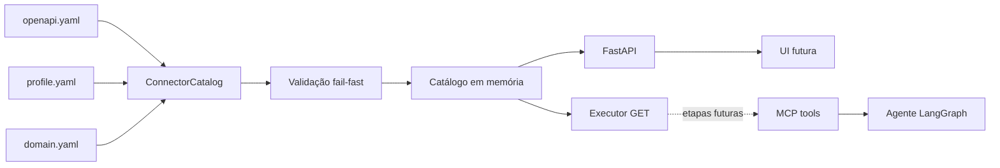
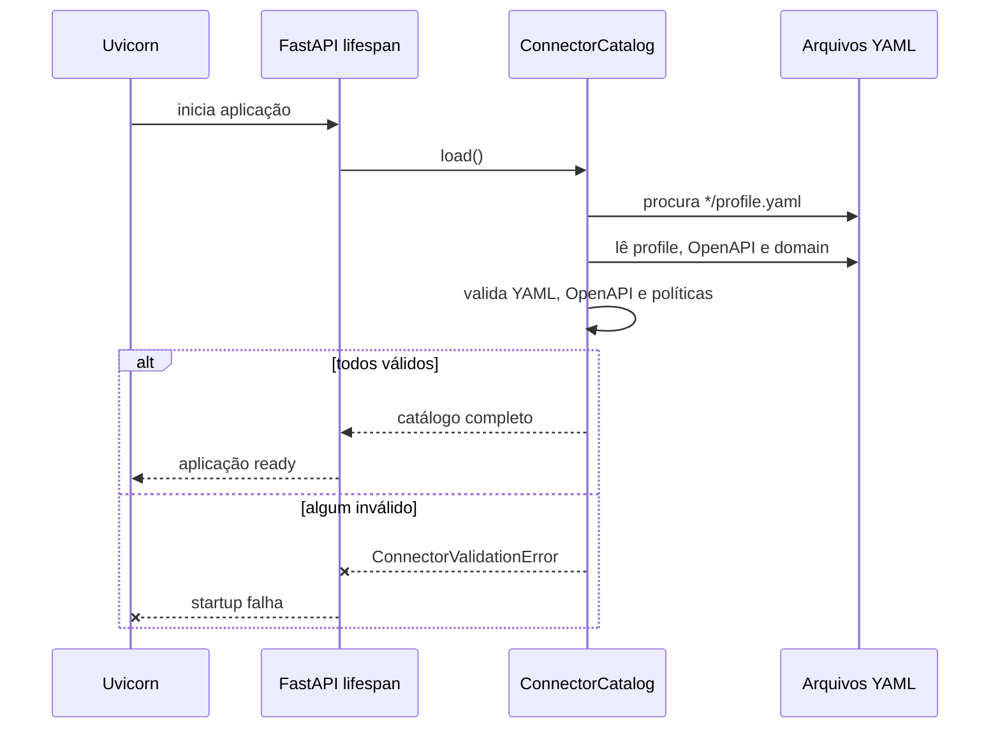
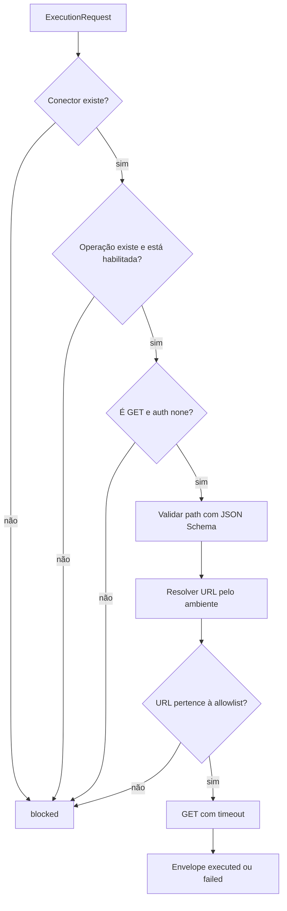

# Arquitetura atual

## Ideia central

O IndusGuard separa a descrição de uma API da decisão de permitir que um agente a utilize.
OpenAPI é um contrato técnico, não uma autorização. Por isso, cada integração também precisa de um
perfil de política local.

As linhas contínuas representam o que já está implementado. O executor ainda é uma interface
interna: nenhuma rota do FastAPI o chama. As linhas tracejadas mostram o próximo caminho de
desenvolvimento.

## Responsabilidade de cada arquivo do conector

| Arquivo | Pergunta respondida | Exemplo |
|---|---|---|
| `openapi.yaml` | O que a API oferece? | `PATCH /assets/{assetId}` existe e recebe JSON. |
| `profile.yaml` | O que o agente pode usar? | A operação exige `action_high` e confirmação. |
| `domain.yaml` | Como interpretar o domínio? | `baseline` significa estado normal aprendido. |

Essa separação permite trocar a Tractian por outra API sem colocar regras industriais no núcleo
Python.

## Fluxo de startup

Falhar no startup é preferível a subir parcialmente. Se uma operação desaparecer por drift de
contrato, o serviço não deve fingir que a integração está saudável.

## Fronteiras de confiança

O núcleo assume que arquivos de conectores são entrada não confiável até terminarem a validação.
As principais barreiras atuais são:

1. somente OpenAPI 3.x;
2. chaves YAML não podem ser duplicadas;
3. `$ref` precisa apontar para o próprio documento;
4. requests e responses precisam ser JSON;
5. conteúdo binário não é aceito;
6. o OpenAPI precisa permanecer dentro da pasta do conector;
7. operação ausente do profile começa desabilitada;
8. política de leitura/escrita não pode contradizer o método HTTP.

O primeiro corte do executor acrescenta validação JSON Schema para path, percent-encoding,
allowlist da URL efetiva, timeout e envelope comum. Autenticação, query, body, retry, redaction e
simulação de mutações continuam bloqueados até receberem testes específicos.

## Fluxo do primeiro executor

O request não contém URL. Ele contém somente `connector_id`, `operation_id`, argumentos e
contexto. Essa decisão impede que agente ou usuário convertam o executor em um proxy para destinos
arbitrários.

O catálogo mantém agora duas visões:

- `ConnectorDetails`: cópia pública usada pelas rotas atuais;
- `LoadedConnector`: profile e parâmetros OpenAPI internos usados por `resolve_operation()`.

Essa separação fornece ao executor os metadados necessários sem aumentar a superfície pública.

## Liveness e readiness

Os dois sinais têm propósitos diferentes:

- `/health` responde enquanto o processo HTTP está vivo;
- `/ready` só fica disponível depois do lifespan carregar todos os conectores.

Em deployment, o balanceador poderá reiniciar um processo que falhou e evitar enviar tráfego a uma
instância cujo catálogo ainda não esteja pronto.

## Estado atual e roadmap

| Capacidade | Estado |
|---|---|
| Validação OpenAPI/YAML | Implementada |
| Catálogo genérico | Implementado |
| Tractian com 18 operações | Implementado |
| Segundo conector sem código específico | Implementado |
| Endpoints operacionais | Implementados |
| Executor GET, path e allowlist | Implementado internamente |
| Query, body e autenticação | Próxima etapa |
| Policy engine em runtime | Planejado |
| MCP e LangGraph | Planejado |
| Persistência e OpenTelemetry | Planejado |
| Frontend Next.js | Planejado |
| Benchmark `prompt_only` × `guarded` | Planejado |
