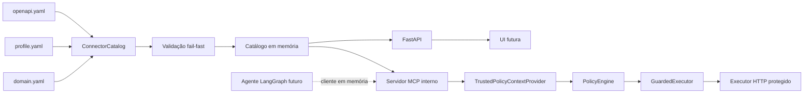
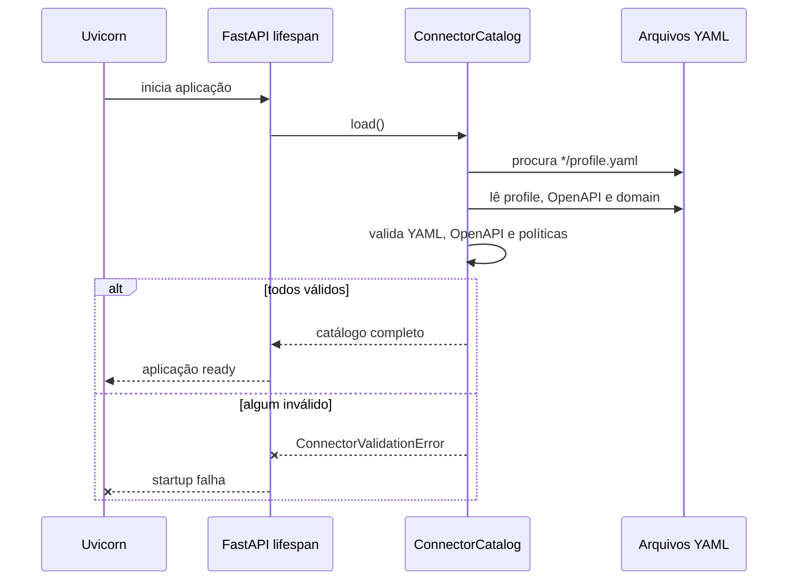
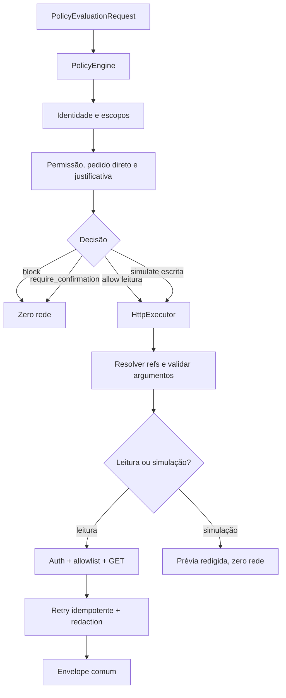
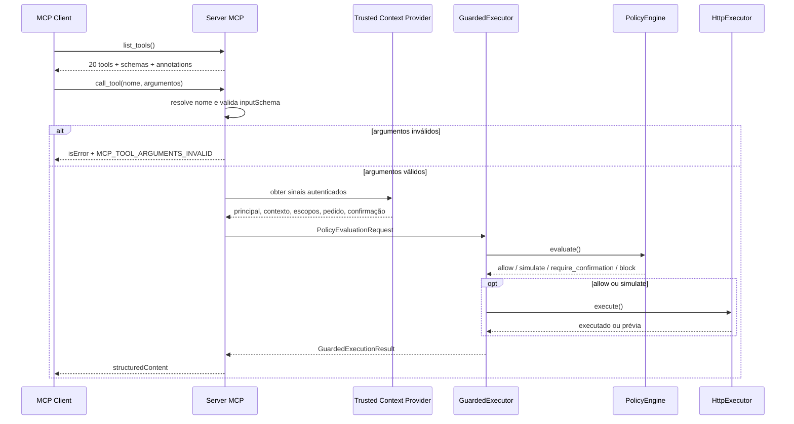

# Arquitetura atual

## Ideia central

O IndusGuard separa a descrição de uma API da decisão de permitir que um agente a utilize.
OpenAPI é um contrato técnico, não uma autorização. Por isso, cada integração também precisa de um
perfil de política local.

As linhas contínuas representam o que já está implementado. MCP, policy engine e executor são
interfaces internas: nenhuma rota do FastAPI os chama e o MCP não abre porta. A linha tracejada
mostra o próximo consumidor, o host LangGraph.

## Responsabilidade de cada arquivo do conector

| Arquivo | Pergunta respondida | Exemplo |
|---|---|---|
| `openapi.yaml` | O que a API oferece? | `PATCH /assets/{assetId}` existe e recebe JSON. |
| `profile.yaml` | O que o agente pode usar? | A operação exige `action_high` e confirmação. |
| `domain.yaml` | Como interpretar o domínio? | `baseline` significa estado normal aprendido. |

Essa separação permite trocar a Tractian por outra API sem colocar regras industriais no núcleo
Python.

## Fluxo de startup

Falhar no startup é preferível a subir parcialmente. Se uma operação desaparecer por drift de
contrato, o serviço não deve fingir que a integração está saudável.

## Fronteiras de confiança

O núcleo assume que arquivos de conectores são entrada não confiável até terminarem a validação.
As principais barreiras atuais são:

1. somente OpenAPI 3.x;
2. chaves YAML não podem ser duplicadas;
3. `$ref` precisa apontar para o próprio documento;
4. requests e responses precisam ser JSON;
5. conteúdo binário não é aceito;
6. o OpenAPI precisa permanecer dentro da pasta do conector;
7. operação ausente do profile começa desabilitada;
8. política de leitura/escrita não pode contradizer o método HTTP.

Os três cortes do executor acrescentam validação JSON Schema para path, query, headers e body,
resolução local de `$ref`, quatro estratégias de autenticação, percent-encoding, allowlist,
timeout, retry idempotente, redaction e simulação segura de mutações.

O quinto corte acrescenta outra fronteira: somente operações habilitadas viram tools; nomes e
schemas são validados no startup; argumentos são validados antes de buscar identidade; e a tool
não aceita claims confiáveis como entrada.

## Fluxo protegido atual

O request não contém URL. Ele contém somente `connector_id`, `operation_id`, argumentos e
contexto. Essa decisão impede que agente ou usuário convertam o executor em um proxy para destinos
arbitrários.

### Origem dos sinais confiáveis

- `principal.id`, permissões e escopos vêm da camada autenticada do runtime;
- `resource_scopes` virão de evidências consultadas, como o vínculo do ativo à empresa;
- `execution.context` é o contexto validado da run;
- `direct_request` registra se a pessoa pediu explicitamente a ação;
- `confirmation` liga a mesma pessoa ao SHA-256 da ação exata.

O LLM não preenche permissões nem escopos. Para cada `required_scope`, a policy engine exige
presença e igualdade exata nas três fontes: principal, recurso e contexto. No conector Tractian,
ações empresariais declaram `required_scopes: [company_id]` no YAML; o Python permanece genérico.

O catálogo mantém agora duas visões:

- `ConnectorDetails`: cópia pública usada pelas rotas atuais;
- `LoadedConnector`: profile e parâmetros OpenAPI internos usados por `resolve_operation()`.

Essa separação fornece ao executor os metadados necessários sem aumentar a superfície pública.

## Fluxo MCP interno

O nome da tool resolve conector e operação por um mapa interno; o cliente não escolhe URL nem
repete IDs dentro dos argumentos. O `inputSchema` é derivado do OpenAPI e usa quatro grupos:
`path`, `query`, `headers` e `body`. Referências `#/components/...` são copiadas para `$defs`, pois
o documento OpenAPI completo não é exposto ao cliente.

`TrustedPolicyContextProvider` é uma interface, não uma implementação permissiva. O runtime que
hospedar o servidor deverá obter os sinais de autenticação e evidência. Provider ausente ou com
falha produz `TRUSTED_CONTEXT_UNAVAILABLE`; nunca faz fallback para claims enviados pelo agente.

Bloqueio político e confirmação pendente são resultados válidos do domínio, com `isError=false`.
Erros de protocolo ficam separados de falhas do upstream: um HTTP 503 autorizado aparece dentro
de `execution.error`, enquanto tool desconhecida ou argumento inválido usa `isError=true`.

## Liveness e readiness

Os dois sinais têm propósitos diferentes:

- `/health` responde enquanto o processo HTTP está vivo;
- `/ready` só fica disponível depois do lifespan carregar todos os conectores.

Em deployment, o balanceador poderá reiniciar um processo que falhou e evitar enviar tráfego a uma
instância cujo catálogo ainda não esteja pronto.

## Estado atual e roadmap

| Capacidade | Estado |
|---|---|
| Validação OpenAPI/YAML | Implementada |
| Catálogo genérico | Implementado |
| Tractian com 18 operações | Implementado |
| Segundo conector sem código específico | Implementado |
| Endpoints operacionais | Implementados |
| Executor GET, argumentos e allowlist | Implementado internamente |
| `$ref` local e quatro estratégias de autenticação | Implementados |
| Escrita simulada, retry idempotente e redaction | Implementados internamente |
| Policy engine e `GuardedExecutor` | Implementados internamente |
| MCP interno com schemas e contexto confiável | Implementado e testado em memória |
| Escrita real | Bloqueada por `REAL_WRITE_DISABLED` |
| LangGraph e Groq | Planejados |
| Persistência e OpenTelemetry | Planejado |
| Frontend Next.js | Planejado |
| Benchmark `prompt_only` × `guarded` | Planejado |
